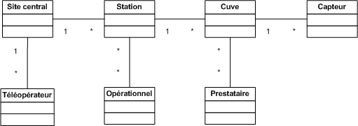

Introduction
#############

Ce document vise à présenter comment le système cible pourrait être implémenté et mise en place d'un point de vue technique. Il s'agit donc de présenter les moyens et solutions mis en oeuvre pour répondre aux exigences fonctionnelles et non fonctionnelles établies dans le dossier de spécification des besoins. L'objectif ici est de rentrer suffisamment dans les détails pour prouver que l'ensemble des cas d'utilisations ou scénarios sont faisables dans le système visé. Il s'agit donc d'une validation fonctionnelle et d'un excellent moyen de garantir une réalisation maitrisée : toute problématique complexe est mise à plat et l'estimation du projet sera plus précise.

Ce document sera structuré de manière à comprendre le système cible sous différente facettes, à la fois par sa découpe en sous-sytèmes et à la fois par ses caractéristiques techniques : matérielle et logicielle. 

Modèle du domaine
##################

L'objectif du diagramme suivant est de présenter de manière synthétique l'ensemble des acteurs et entités du système ainsi que leurs relations.



A priori il n'existera qu'un site central chargé du monitoring à distance. Celui-ci sera opéré par des téléopérateurs.
Le site distant est chargé de la surveillance d'une multitude de stations distantes, elles même composées par un ensemble de cuves.
Chaque cuve sera monitorée par un ensembles de capteurs chargés de collecter un ensemble de mesures en lien avec l'état de la cuve.
Des opérationnels sont des personnes ayant pour responsabilité la maintenance d'un ou plusieurs sites.
Les prestataires sont les organisations ou entreprises chargées d'effectuer les opérations de livraison/enlèvement. Chaque cuve ayant un contenu spécifique, elle se voit attribuer un ou plusieurs prestataires spécifiques à sa nature.

Architecture globale détaillée 
################################

_ TODO: insérer schéma complet + description détaillée _

Architecture matérielle
########################

- TODO: manque de détails + rédaction _

Site central
==============

Postes de travail
------------------

L'équipe de téléopérateurs, estimée à 10 personnes, évoluera sur des postes de travail standards, ceux ci ne nécessitant finalement qu'un navigateur web compatible avec standard HTML5. Etant donné que la puissance de calcul et la totalité du stockage sont déportés du côté de l'infrastructure du serveur il ne sera pas nécessaire d'acheter des postes de travail performants. L'idée étant de limiter le coût de l'unité central. De plus l'accès au système étant indépendant du système d'exploitation, l'utilisation d'une plateforme libre comme Linux (Ubuntu ou autre distribution) est justifiée. Ces économies pourront en partie être utilisées pour offrir un maximum de confort aux téléopérateurs comme l'achat de deux écrans plats grand diamètre par poste, ce qui se révèle extrêmement adapté pour des tâches de monitoring.

Il conviendra de mettre en place un réseau local regroupant ces postes afin d'une part de partager la connexion internet et d'utiliser ce réseau à des fins de partage de documents.

Serveurs
---------

Tout d'abord l'hébergement et la maintenance ces serveurs seront laissé à la charge d'un prestataire externe pour des raisons de coûts, de fiabilité, de sécurité et de haute disponbilité.
Des serveurs privées seront choisis afin de garder un contrôle total du système et de garantir des perfomances suffisantes dans les traitements. 

Dans un souci d'extensibilité et de mise à l'échelle, l'architecture serveur pourra être découpée en plusieurs serveurs chacun dédié à une fonctionnalité : serveur web, serveur applicatif, serveur hébergeant la base de données, etc. Les performances pourront être améliorées grâce à la technique du load-balancing et donc exploiter la redondance.

Une préférence se porte vers des serveurs fonctionnant sous des systèmes Unix pour des raisons de couts mais aussi pour garder un maximum de contrôle administratif et de compatibilité avec la partie applicative.

Ces serveurs devront être suffisamment puissant suivant le nombre et le genre des traitements effectués. 

Côté stockage, les serveurs devront avoir une capacité suffisante (qui reste à établir) pour stocker l'ensemble des données applicatives mais aussi les historiques d'opérations. Il faudra veiller à ce que le prestataire réplique ces données pour éviter toute perte, si possible sur un autre site géographique. 

En cas de panne, le prestataire doit être en mesure de remettre en marche le système de manière fonctionnelle rapidement et le nombre de pannes doit être limité dans l'année (99,9% soit moins de 8,75 heures par an).

Sites distants
===============

_ TODO: a retravailler => reprendre les conclusions de l'étude de faisa _ 

Capteurs
---------

Chaque cuve sera équipé d'un ou plusieurs capteurs. Bien que générique, ce système ne considérera pour l'instant que la mise en place de capteur de niveau de liquide.
Le choix est porté vers un capteur peu cher, autonome et interfaçable avec le système embarqué de la cuve :  Capteur OTT RLS (75 dollars pièce).

Système embarqué
------------------

Chaque cuve comprendra un système embarqué. La solution intégrée Ember EM250 a été retenue (1 dollar par chipset + 2000 dollars pour le kit de développement unique).
La noeud maitre ne sera pas différent des autres mis à part son module indépendant de gestion de la communication longue distance : modem GSM/GPRS (100€ - 300€ pièce).
De plus il contiendra une carte de stockage utilisée pour bufferiser les données à envoyer au site central (cas du mode déconnecté).

Production d'énergie
----------------------

Chaque composant sera hautement indépendant vis à vis de sa consommation électrique. Chaque composant consomme peu, et de plus est capable de rentrer en mode veille extremement peu consommateur.
Ils seront alimentés via des piles et pour certaines régions couplés avec un mini panneau solaire pour la recharge (50€ par panneau et 50€ - 200€ par pile).

Architecture applicative
#########################

Site central
=============

L'architecture applicative sur le site central se décompose en trois couches: base de données, noyau applicatif et client web.

Base de données
-----------------

Le système central dispose d'une base de données qui s'occupe de la centralisation et du contrôle des données.
La solution que nous avons choisi est la base de données relationnelle objet PostgreSQL. C'est un système de base de données libre qui est largement reconnu pour son comportement stable et aussi pour ses possibilités de programmation étendues, directement dans le moteur de la base de données, via PL/pgSQL. Nous utilisons également le plugin PostGIS pour activer la manipulation d'informations de géométrie (points, lignes, polygones). Ce fonctionnement très particulier peut faciliter largement la gestion des données géographiques (ex. la localisation des stations et suivi des camions en temps réel). 
Les interactions avec la couche base de données se font par l'intermédiaire de commandes PL/PGSQL standardisées. Ces commandes permettent à la fois de consulter les données enregistrées, d'en enregistrer de nouvelles ou de modifier celles existantes.
Dans cette base de données, plusieurs types de données seront sauvegardés. Il y a d'abords des données propres du système telles que les informations des stations, leurs configurations. Ensuite, on a des valeurs de mesure pour chaque station et chaque capteur plus précisément. Enfin, pour la raison de traçabilité, les traces applicatifs du serveur et de tous les systèmes embarqués sont enregistrées. Ces informations pourront être utilisées en cas de problème ou d'analyse de l'activité.

Noyau applicatif
-------------------

Le noyau applicatif constitue le moteur du système informatique.
Seront développées des applications en Java pour traiter des données, configurer le système, gérer la planification et des alarmes. 
- Traitement des données
L'application reçoit des données émites par des stations. Elle les persiste dans la base de données. Elle font également des analyses sur ces données et les fournissent à l'interface pour présenter aux utilisateurs.	
- Configuration du système
L'application permet aux utilisateurs à paramétrer ou commander le système.  Elles vérifient la cohérence des commandes et des paramétrage avant de les envoyer à la station destinataire. Elle se charge aussi de la mise à jour des système embarqués.
- Planification
L'applicaion est capable de surveiller le niveau des réservoirs grâce aux données envoyés par des capteurs et suivre en temps réel des camions équipés de GPS. Cela permet de planifier les trajets des camions.
- Gestion des alarmes
L'application reçoit des alarmes qui signalent un niveau faible de batterie ou d'autre dysfonctionnements de systèmes embarqués. Elle est capable de réagir de façon automatique pour résoudre certains problèmes ou avertir l'utilisateur.

Client web
------------

Les utilisateurs abordent le système par un navigateur internet.
L'interface client sera donc réalisé avec des technologies standards du web. Cela garanti un accès au système aussi large que possible. Les utilisateurs pourront donc accéder au système par un navigateur web standard. HTML5 (HyperText Markup Language 5) est la dernière révision du principal langage du web. C'est un futur standard incontournable du web qui est déjà adopté par des acteurs majeurs. Elle permet de concevoir une interface conviviale pour utilisateur sur un pc ainsi que sur un mobile. Le stockage des données en mode déconnecté et l'API de géolocalisation de HTML5 sont surtout très pratique pour le client mobile/PDA.
Grâce à ce client web, utilisateur peut accéder aux données brutes des stations, visualiser des indicateurs ou des graphes calculés et générés par le noyau applicatif, configurer le système ou envoyer une commande manuel à une station. Le client web possède une procédure d'authentification permettant de contrôler des accès aux données et le droit aux différentes fonctionnalités (ex. un téléopérateur, un opérateur et un administrateur auront des privilèges différents).

Sites distants
===============

Un OS très léger tourne sur chacun des système embarqué. Cette OS offre la possibilité d'effectuer des traitements mineurs ainsi que l'émission et la réception des données. Dans chacune des stations, on distingue un système maître et des systèmes esclaves.

Système esclave
------------------

Le système esclave se réveille à un intervalle de temps régulier qui est paramétrable. Il effectue un nombre de mesures qui est également paramétrable en tenant compte de type de capteur, niveau de batterie du système etc. Les valeurs de capteurs seront transmises au système embarqué de manière brute. Le système embarqué calcul la moyenne des valeurs mesurées et l'envoie au sysème voisin en format uniformisé en rajoutant l'identifiant de cuve, unité de valeur etc... Au cas où un dysfonctionnement est détecté, une alarme sera générée et envoyée.
Quand le système esclave reçoit un message, s'il s'agit du message d'un système voisin destiné au système maître, il le transmet au système suivant. Si le message lui est destiné contenant des données de configuration, le système doit se reconfigurer.

Système maître
---------------

Le système maître possède le même fonctionnement que le système esclave au niveau de récolte de données. En plus, il reçoit les données de systèmes esclaves qui se trouvent dans la même station. Il est chargé d'envoyer ces données par le réseau GSM en protocol Http au serveur central.
Le système maître reçoit également des messages de configuration ou des commandes d'utilisateur. Il les redistribue aux systèmes esclaves.

Synchronisation
----------------

Dans une station, tous les systèmes embarqués seront synchronisés. Il est possible de paramétrer de sorte qu'ils se réveillent en même temps régulièrement pour effectuer la mesure, le traitement, l'emission et la réception de données. Cette synchronisation permet aux systèmes de se mettre en veille profonde (Fermeture des recepteur et émetteur) durant le reste du temps afin de réduire la consommation d'énergie.


Architecture de communication
#############################

Cette partie va détailler l'architecture de communication, en se basant sur des
scénarios (nominal ou alternatifs).

Flux d'information
===================

Cas nominal
-------------

Toute les noeuds du réseau de capteur sont en sommeil profond, consommant ainsi très peu d'énergie.
Lorsqu'un noeud se réveille, il fait l'acquisition de *n* valeurs, à raison
d'une valeur toute les *x* secondes.  Il fait alors un filtrage sur ces *n*
valeurs, et envoie au noeud *MASTER* un trame de ce type : ::

    moyenne\n
    max\n
    min\n
    ecart-type\n 

Une trame de ce type permet, sans surcharger le réseau, de rendre compte des
éventuelles erreur (min et max très différent de moyenne). Une fois que cette
trame a été envoyée, le noeud place son timer de réveil à *y* unité de temps, et
se met en sommeil (profond ou de reception, dépendant de sa place dans le réseau
maillé), pour consommer très peu.

Quand le noeud *MASTER* reçoit une trame, il peut identifier le noeud grâce à
son adresse dans le protocole ZigBee. Il envoie alors une trame de ce type, au
central, par GPRS : ::

    <SiteData id=iiii>
        <Sensor id=xxxx>
            <Record time=kkkk>
                <avg> yyyy </avg>
                <max> zzzz </max>
                <min> uuuu </min>
                <sdev> vvvv </sdev>
            </Record>
        </Sensor>
    </SiteData>

Le noeud *MASTER*, pour plus d'efficacité, procède par fenêtre de temps pour
l'envoie par GPRS. Ainsi, il attend de collecter quelque trames (le temps
pendant lequel le noeud *MASTER* attend de recevoir des trames étant
paramétrable) avant d'envoyer d'un coup tous les enregistrement.

Les raison justifiant ce comportement sont l'efficacité, et la consommation en
énergie. En effet, tout d'abord, plus nous avons de données à envoyer, plus une
compression des données sera efficace, ce qui réduira la bande passante à
utiliser, qui est un composant critique, d'autant plus que les données sont sous
format XML, donc supportant très bien la compression : pour un fichier d'environ
15000 mesure (````record````) encodé dans le format XML ci-dessus, le fichier
brut fait 1.5Mo, alors qu'il le fait plus que 60Ko une fois compressé en bzip2.
Ensuite, le coup de mise en route d'un connexion GPRS est probablement important
en terme de calcul, d'émission radio, et donc de consommation.

Cas alternatifs
----------------

Panne temporaire de réseau GPRS
    Si le noeud *MASTER* a une panne temporaire de réseau GPRS, il stocke dans une mémoire de masse les données reçues par le noeud. Il ne sera pas nécessaire d'avoir une mémoire de masse trop importante, puisque les données ne sont en fait que collectés assez rarement, et, une fois compressées, prennent peu de place en mémoire.

Envoie d'une commande de changement de paramètre
    Lorsque le site central désire changer un paramètre à distance sur un noeud, il envoie une trame respectant ce format : ::

        <ParamChange>
            <Node id=xxxx>
                <Key>yyyy</Key>
                <Value>zzzz</Value>
            </Node>
        </ParamChange>

    
    Il est ainsi possible de changer les paramètre pour plusieurs capteurs à la
    fois, au sein d'un même site.


Mise à jour système
    Lorsque le site central désire changer le système d'un des noeuds, il envoie
    une trame respectant ce format : ::

        <SystemUpdate>
            <Node id=xxxx>
                <Data version=xxxx>
                    hfjOW+n70kqDj9vyHBMTVX1mNaQFUfnsUZ/Kaoo6M2sKOYE+aMAdo
                    VSea426VvtR+pggWk0mirulRRxY+aVqXn6ql3+lShV1ABiPnvaUn/
                    ZA7JdQEH6GiMw/FpNb63Z+j4+LYx8sqKOfXuW5YF70a+tuuKkiUCP
                    /FYP7o79whAqVsE3n+FP6mJkCyAZQbr+7EenOhktvCZHy83e1a/0w
                    Xa40Fdcv9YI9OTG7Fy8rF0nB1SJZ5WQ10EwHhISWxqLxNx7tn5KaF
                    B57xvhSQmLni/A8VMzT+wCcr6VEUo0pD8SzqbYEfVrhCY7jG1Wksd
                    mA0WpuOr5aHtL43X3OosVZ6Lcwtj/nYMCVVLQhaE9+Pt0W173A+bF
                    3j95FmtMf9aU/reXNx++yFANxSe1o43gu/qDRuT6AF02hX9YWVsaW
                    F/VeblQPLtcxSgFVeggLPIteIcRJBbiFgXmMqIJN0Xv2w8ZMKy6bN
                    MCvKtncT2/tgSKGzIGsvh7GkrzuDDvVEV8HrAfBhqklkbrWVscyRx
                    JTvWVwm3sL97MbPVQhPGtuCPLvxlgci4mhzP8QtYGLs/V6VK44oa4
                    QnY9Pee53aaqA7QbgIal6GOg7oYtf24u63pZYa44d7NHol88eXt+L
                    F1kKnvFhzaqVkn04il895R3Ta+NS6WmHHDa3DQYXc7Bphs3MLs0yM
                    dBNJMRXCk+9X/vpUuPLyH5H+lTPvWWqH3m6oBSbZHMPid8pUbxQIH
                    NP0JsvSv9dt27goPR3jSvhAtY6XtfXa3Y7t8NKNY1YDs51d6dwwuc
                    6oAjc4FA1JSCWDZFc4UwnJUCOOTwDlLG7XuVvDOH+BBscD3NmhuPN
                    nhnGJGj6ReDAzSzTXic0qNGROsSwravfvL2dB15jZAc1q+PqPVa2j
                </Data>
                <CheckSum type='SHA-512'>
                    b4c4cef348831c6a623fa395a3dbb47966972d33220b66ef2629d
                </CheckSum>
            </Node>
        </SystemUpdate>


    La partie entre les balises <Data> est encodée en base 64, permettant de
    transmettre des données binaires sous forme de texte. Un checksum est fourni
    pour vérifier l'intégrité des données, une mise à jour de ce type étant
    critique. Si les sommes de contrôle diffère, la mise à jour ne sera bien sûr
    pas appliquée.


Stockage
--------

stockage, volumétrie/dimensionnement


Annexes 
#######

Problématique sur la sécurité
================================

* La sécurité du système à développer sera directement liée à la sécurité des sites surveillés. On va assurer que les informations qui seront transmises à un système embarqué ne viennent pas d'une source non approuvée.

* On limitera ainsi les possibilités de piratage des sites distants qui pourraient avoir des conséquences graves sur la surveillance des sites, on fera plus attention si le site surveillé est sensible.

* De même pour les données transmises automatiquement par les sites distants, on mettra  en place un protocole de communication sécurisé, tel que le protocole SSL (Secure Sockets Layer).

* L’intégrité de la configuration des systèmes embarquées et l'intégrité des données captées dépendant directement des requêtes effectuées par l’interface Web, on peut mettre en place une politique de sécurisation des connexions. Exemple : chaque personne qui veut accéder à l’interface Web devra posséder les autentifiants nécessaires pour réussir à s’y connecter.

Gestion du Système
===================

* L'isolement qui existe entre les différents sites nécessite de pouvoir mettre à jour la configuration du système embarqué à distance.

* On réalisera un développement qui permettra de récupérer un ordre de mise à jour de la configuration venant du site central et mettre effectivement à jour la configuration du système embarqué ou de ses périphériques

* On pourra configurer à distance des paramètres tels que la taille de la base de données pour le stockage des mesures, pour le stockage des opérations, les noms des périphériques, etc.

Problématique de mise à l'échelle
==================================

Le système prévu sera 10 fois plus important que l'existant scandinave, soit :
* 100 sites distants x 10 = 1000 sites distants
* 1000 sites distants x 10 cuves = 10000 cuves

Les infrastructures matérielles seront capables de supporter à la dois les fux de données transistants sur les réseaux internes aux stations et sur les réseaux GRPS. 

De plus côté site central, le serveur web d'aggrégation des données sera suffisamment puissant pour traiter l'ensemble des requêtes. De plus il devra garantir une très haute disponibilité par la mise en place de système de réplication en cas de pannes. Concernant les données stockées, le système sera capable de stocker des données sur une échelle de temps d'au moins deux ans.

Bien que prévu pour ces limites, le système pourra facilement être remis à l'échelle. D'une part l'ensemble de la conception est basé sur la généricité et l'indépendance par apport à son objectif métier. D'autre part les systèmes nécessitant la mise à l'échelle sont concentrées en certains points (serveur de base données, serveurs web, réplication, réseaux, etc.). L'intégration de nouveaux sites distants ou l'ajout de nouvelles cuves ou par extension tout autre système de surveillance se feront sans réels challenge techniques. Les connaissances acquises lors des projets de déploiement sur sites seront exploitées afin de faciliter la répétition de cette opération. 

Analyse de la complexité
==========================

* On travaillera avec le réseau GPRS pour réaliser la communication entre les différentes sites. Comme on le sait très bien, la technologie GPRS n’est pas vraiment fiable à 100%, on fera tout le possible afin d’anticiper les éventuels difficultés qui pourraient survenir au cours de l’exploitation.

* Les ressources des systèmes embarqués sont un peu limitées, On réalisera le développement du système de tel façon qui soit optimisé pour que cette limite ne soit pas un empêchement au bon fonctionnement du logiciel.

* En cas qu'un capteur fournit des valeurs incorrectes, le système embarqué pourra reconnaître l'erreur de cette valeur et le serveur central pourra indiquer des valeurs particulières, après on passe au changement de capteur.

* Le système est soumis fortement aux contraintes et/ou catastrophe naturelles, il faudra alors qu'on passe au remplacement du système embarqué.
