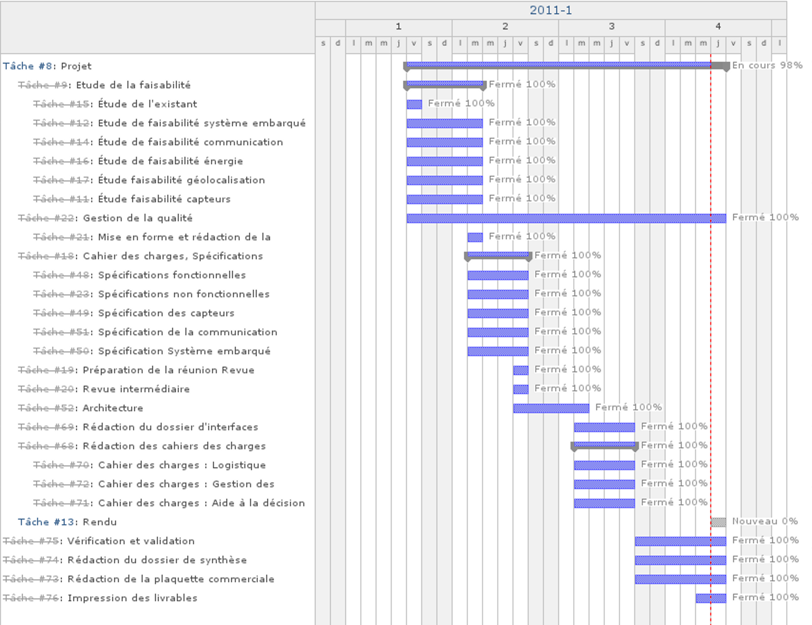

Organigramme des tâches
-----------------------

Macro-phasage
=============

Grandes phases du projet :

  * Étude préliminaire (réponse à l'appel d'offre) (Séances 1, 2 et 3)

    * Analyse de la faisabilité et étude de l'existant (Séance 1)

    * Spécification technique des besoins (Séance 2)

    * Architecture générale du système (Séance 3)

  * Conception détaillée (Séances 4 et 5)

    * Découpage des systèmes en sous-systèmes (Séance 4)

    * Rédaction des cahiers des charges des sous-sytèmes (Séance 5)

Digramme de Gantt
=================

