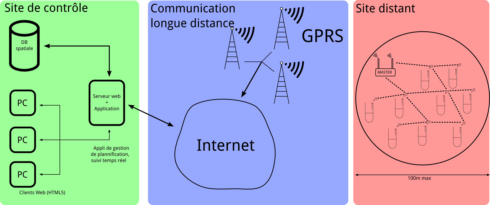

###################
Dossier d'interface
###################

.. contents:: Sommaire
    :depth: 3
.. sectnum::

.. page::

Découpage du projet
###################

Le schéma suivant permet d'identifier clairement les différentes parties du
projet, qui seront découpés en sous-projet.

Le projet est effectivement découpé en trois sous-parties principales, le site
de contrôle, la communication longue distance, et les sites distants.

Ces parties seront elles-mêmes découpées en sous parties, et des interfaces
(au sens d'API, Application Programming Interface) seront spécifiée, afin de
fixer les interfaces entre les modules, et permettre ainsi de faire du
développement en parallèle. Les lecteurs qui ont des connaissances en
programmations trouverons peut être plus facile de lire directement la dernière
section, celle-ci étant plus formelle que les précédentes.

.. page::

Description des blocs
#####################

Site de contrôle
================

Ce bloc peut être découpé en plusieurs sous blocs, donc voici un rapide
descriptif :

Monitoring
  Suivi en temps réel de l'activité des stations. Aucun mécanisme d'alerte n'est
  mis en place, celui-ci correspondant à un calcul fait par le site de contrôle
  lui-même.

Commande des sites distants
  Changer des paramètres, mettre à jour les logiciels.

Planification de la maintenance sur site
  Permet de planifier les modalité des maintenances sur site, comme leur
  fréquence, ou encore demander une maintenance exceptionnel sur une site, par
  exemple en cas d'urgence.

Suivi en temps réel des opérations de maintenance
  Suivi géotemporel des opérations de maintenance, permettant d'assister un
  technicien sur site lors d'une intervention, par le biais de matériel
  spécifique dont il est équipé.

Communication longue distance
=============================

Envoi de données d'un site distant vers le site central
  Communication unidirectionnelle entre un site distant, et un site central,
  dans le but d'envoyer des valeurs de mesure.

Envoi de données du site central vers un site distant
  Communication entre le site central vers le site distant, dans le but
  d'envoyer des commandes de changement de paramètre, ou des mises à jour
  logicielles.

Site distant
============

Ce bloc peut de la même manière être découpé en plusieurs blocs fonctionnels :

Acquisition de données brutes
  Obtentions de données de capteurs, sans se soucier de leur format.

Communication interne
  Communication entre les noeuds ZigBee (routage, etc.).

Traitement des données au niveau noeud
  Traitement des données au niveau de chaque capteurs (par exemple moyennage).

Traitement des données au niveau site
  Traitement des données par le noeud *MASTER* de chaque site. Ce bloc inclue
  aussi les fonctions pour gérer la persistance dans le cadre d'un
  fonctionnement déconnecté.

.. page::

Définition des interfaces
#########################

Les échanges entre les blocs se feront de plusieurs manières.

À l'intérieur des réseaux de capteurs, la communication est faite de manière
transparente par l'intermédiaire du protocole ZigBee. Le protocol est en mode
texte, et peut être spécifique à chaque capteur ou chaque site.

Entre les sites distant et le site central, le format est normalisé, XML
compressé, permettant d'abstraire le fonctionnement du réseau de capteurs, et
donc de se protéger d'un éventuel changement ou évolution.

À l'intérieur du site central, les échanges de données se feront par
l'intermédiaire de requêtes HTTP (les employés utilisant l'application à
travers un navigateur internet). SQL sera utilisé par le logiciel serveur pour
insérer et consulter les données des capteurs dans la base de données.

Pour communiquer entre le serveur et les applications clientes, un technologie
du type AJAX (Asynchronous Javascript And XML) sera utilisé.

Nous utilisons donc un modèle de type 3-tiers, où le bloc « Communication
longue distance », étant le tier du milieu, permet de découpler fortement la
solution. L'utilisation de technologies de type web et moderne assure une
compatibilité avec les technologies et outils existants. L'accent a été mis sur
les protocoles standards, largement suffisant pour notre solutions. Quand aucun
protocole standard n'était disponible, l'approche a été de suivre l'idiome KISS 
(*Keep it simple and straightforward*), par exemple en utilisant des protocoles
texte, extrêmement simple à comprendre, implémenter, et étendre.

.. page::

API des blocs
#############

Les API présentées ci-dessous correspondent à celles qui seront disponibles à un
développeur pour implémenter le système. Il est fait grand usage d'appels
asynchrone demandant des fonctions de *callback*, l'utilisateur devant fournir
ses propres fonctions qui traiteront les arguments proposés.
Les fonctions sont, par défaut, asynchrone, et les fonction synchrone,
nécessitant la prise en compte du programmeur au niveau multi-tâche seront
clairement indiquée dans leur descriptions.

Conventions
===========

La syntaxe de ces API ne correspond pas à un langage en particulier, et s'inspire de
beaucoup de langage de programmation. Les paramètre seront entre parenthèses,
séparés par une virgule.

Le type de retour est spécifié, comme en C ou en Java, avant le nom de la
fonction.

Types utilisés
==============
``callID``
  Entier utilisé pour identifier un appel asynchrone au
  sein du système. Deux appels ne pourront pas avoir la même valeur de ``callID``
  dans des temps raisonnablement long, correspondant à la valeur maximum de ce
  type numérique (ex: 65536 pour un entier 16 bits), l'identifiant étant
  incrémenté à chaque appel.

``NodeID``
  Identifiant unique donné à un capteur. Il peut aussi s'agir du noeud *MASTER*.

``SiteID``
  Identifiant unique donné à un site contenant des cuves. Un couple 
  (``NodeID``, ``SiteID``) permet d'identifier de manière unique un
  noeud (capteur ou noeud *MASTER*) du système).

``SensorInfo``
  Structure de donnée contenant toutes les informations d'un capteur :
  coordonnées GPS, format de données, fréquence d'actualisation, etc.

``void``
  En référence à de nombreux langages de programmation, la présence de ce
  mot-clé signifie que la fonction ne retourne pas de valeur. Ça n'est pas à
  proprement parler un type.

Fonction commune aux différents blocs
=====================================

``void ack(callID, returnCode)``
  Fonction qui est appelé après une requête, en utilisant l'API.
  ``callID`` est l'entier qui est retourné à chaque appel, pour la traçabilité
  au sein du système. ``returnCode`` correspond à éventuel code d'erreur, qu'il
  s'agira de mettre en regard avec le ``callID`` pour obtenir le type d'erreur.

.. page..

Site central
============

Ces fonctions ne sont pas des primitives réseau, mais appellent en fait la
couche centrale (communication longue distance), pour communiquer avec les
sites. Il est donc fait une abstraction total du réseau.

Monitoring
----------

Le monitoring est fait en *push*, il n'y a donc pas de fonction de type
``getValue(NodeID)``, bloquante tant que le capteur n'a pas de donnée à
proposer. Cela permet de s'affranchir du besoin de lancer beaucoup de processus
ou de *threads* pour *monitorer* beaucoup de capteurs.

``callID newSensor(SiteID, SensorInfo)``
  Fonction de callback appelée quand un nouveau capteur s'enregistre auprès du
  site central. Cette fonction permet à un nouveau site de s'enregistrer dans le
  système. Il pourra être prévu un procédé cryptographique pour authentifier les
  site. Lorsque cette fonction est appelée, il devient possible de *monitorer*
  le capteur.

``callID addWatch(SiteID, NodeID)``
  Fonction qui permet de demander au système de nous communiquer toute nouvelle
  donnée qui est émise par le capteur ``NodeID`` du site ``SiteID``. Dès lors,
  dès que ce capteur aura des données à envoyer, la fonction ``dataAvailable``
  sera appelée.

``callID removeWatch(SiteID, NodeID)``
  Fonction qui permet de retirer le capteur de la liste de capteur dont les
  données sont surveillées.

``callID dataAvailable(SiteID, NodeID, Data)``
  Fonction de callback appelée quand un capteur a des données disponibles.
  L'identifiant du site est dipsonible dans le champ ``SiteID``.
  L'identifiant du capteur est disponible dans le champ ``NodeID``, et les
  données sont disponibles dans le champ ``Data``.

``callID eventOccured(SiteID, NodeID, event)``
  Fonction de callback appelée quand un capteur veut envoyer un évènement qui
  ne correspond pas à des données, tel une défaillance matérielle, un signal de
  batterie faible, etc. ``event`` contient alors un horodatage, et les informations
  relatif à cet évènement.

  

Commande des sites distants
---------------------------

``callID setValue(SiteID, NodeID, key, value)``
  Permet de fixer une valeur, pour le noeud ``NodeID`` du site ``SiteID``,
  pour un certain paramètre, de nom ``key``. La valeur sera fixée à ``value``.
  Si le noeud n'est pas disponible, car endormi, la valeur sera mis en cache par
  le noeud *MASTER*, et elle lui sera communiqué lors de son réveil.

``callID getValue(SiteID, NodeID, key, value)``
  La valeur de l'attribut de nom ``key`` du noeud ``NodeID`` du site ``SiteID``
  est placé dans l'attribut ``value``.

Planification de la maintenance sur site
----------------------------------------

Les opérations de cette partie sont de très haut-niveau, et ne concernent pas
l'ajout dans un logiciel de planning, qui devra être faite de manière interne au
logiciel.

``callID newMaintenanceOperation(SiteID, NodeID, type, priority, operationID)``
  Ajoute un besoin de maintenance dans le système, permet de communiquer avec
  d'autres système, par exemple de planning, lorsqu'une opération de maintenance
  doit être effectuée sur le système. Le ``type`` correspond à un type d'opération
  de maintenance, l'attribut ``priority`` permet de fixer la priorité pour
  l'opération de maintenance, permettant de faire passer des opérations avant
  d'autres. 

``callID removeMaintenanceOperation(callID)``
  Enlève la demande d'intervention du système, par exemple si elle avait été
  ajouté par erreur.
  Permet de planifier les modalité des maintenances sur site, comme leur
  fréquence, ou encore demander une maintenance exceptionnel sur une site, par
  exemple en cas d'urgence.

Suivi en temps réel des opérations de maintenance
-------------------------------------------------

De la même manière, cette partie ne permet d'obtenir que des informations brutes
concernant une opération de maintenance, c'est à dire consulter une sorte de
fichier de journalisation associé à la tâche de maintenance.

``callID getMaintenanceOperationStatus(callID, status)``
  ``status`` est une structure de donnée qui contient des enregistrement de mise
  à jour d'une tâche de maintenance. Chaque enregistrement peut contenir (non exhaustif) :
  
  - Un horodatage (fuseau horaire GMT, quelque soit l'emplacement du site sur lequel est fait la maintenance).
  - Des coordonnées GPS
  - Un statut pour la tâche (terminée, en cours, en approche du site, etc.).
  - Un commentaire textuel.

  Ces données sont fournies par l'appareillage du technicien envoyé sur site (de
  type *smartphone*).

.. page::

Communication longue distance
=============================

L'API de ce bloc se base sur celle du module QNetwork, version asynchrone, de
Qt, framework C++ développé par Nokia.  Cette API a prouvé son efficacité, dans
l'embarqué tout comme dans le monde du logiciel standard. (Référence : 
http://doc.qt.nokia.com/4.7/qtnetwork.html)

Envoi de donnée d'un site distant vers le site central
------------------------------------------------------

``callID connectToCentral()``
  Permet de se connecter au site central. L'adresse IP du site central est un
  paramètre que le noeud *MASTER* connait. Il n'est donc pas nécessaire de
  l'indiquer en paramètre.

``callID connectedToCentral()``
  Fonction de callback appelée quand le site central et le site distant sont
  connectés.

``callID newConnection()``
  Fonction de callback appelée quand le site central se connecte au site
  distant, par exemple après une perte de connexion, ou lors de la mise en
  service.

``callID closeConnection()``
  Fonction à appeler lorsque le site distant veut fermer la connexion. Cela
  permet au site central de savoir qu'il s'agit d'une perte de connexion
  volontaire, et non d'une erreur.

``callID sendData(data, length)``
  Permet d'envoyer les données ``data`` au site central, par exemple pour
  envoyer des résultats de capteurs, ou des messages de service.

``callID dataAvailable(data, length)``
  Fonction de callback appelée lorsque des données sont disponibles.

Envoi de données du site central vers un site distant
-----------------------------------------------------

``ipAddress getIPFromSite(siteID)``
  Permet d'obtenir l'adresse IP d'un site distant, à partir de son ``siteID``.

``siteID getSiteFromIP(ipAddress)``
  Permet d'obtenir l'identifiant de site distant depuis l'adresse IP.

``callID connectToSite(ipAddress)``
  Permet d'initier une connexion vers un site distant.

``callID pollConnectToSite(ipAddress, frequency)``
  Permet de tenter de se connecter à répétition vers un site distant, à une
  fréquence ``frequency``, dans le cas de la perte de connection.

``callID connected(callID, fd)``
  Fonction de callback appelée quand la connexion est établie. ``callID``
  correspond à celui reçu lors de l'appel à ``connectToSite``, et ``fd`` est un
  petit entier permettant de repérer la connexion.

``callID closeConnection(fd)``
  Permet de fermer proprement une connexion au site distant, par exemple pour
  une opération de maintenance.

``void newConnection(idAdress)``
  Fonction de callback appelée lorsqu'un site distant se connecte au site
  central.

``callID sendData(fd, data, length)``
  Communication unidirectionnelle entre le site central et un site distant, dans
  le but d'envoyer des commandes, ou des mises à jour logicielles.

``callID dataAvailable(fd, data, length)``
  Fonction de callback appelée lorsque des données sont disponibles. ``fd`` est
  alors l'identifiant du site ayant envoyé ces données.

``void b64Encode(inputData, inputLength, outputData, outputLenth)``
  Fonction permettant d'encoder des données en base 64.

``void sha512Encode(inputData, inputLength, outputData)``
  Fonction permettant de calculer le *hash* SHA-512 d'une donnée.

.. page::

Site distant
============

Acquisition de données brutes
-----------------------------

``int getRawData(sensor, value)``
  Appel synchrone. Permet de prendre une valeur depuis le capteur. L'entier en
  valeur de retour permet de détecter une erreur. Ce prototype permet de passer
  un capteur en paramètre pour anticiper le fait qu'il y ait plusieurs capteurs
  par noeud.

Communication interne
---------------------

``int sendDataToNode(NodeID, data, length)``
  Envoie une donnée vers un noeud, en routant les données de manière
  transparente à travers le réseau maillé ZigBee.

``NodeID getMasterNodeID()``
  Renvoie le ``NodeID`` du noeud maitre d'un site. Il doit être unique au sein
  d'un même site. 

Traitement des données au niveau noeud
--------------------------------------

``void addFunctionToPipeline(function)``
  Permet d'ajouter une fonction au pipeline de calcul d'un noeud. La fonction
  est ajouté en fin de pipeline. ``function`` est un pointeur de fonction (ou
  équivalent dans un autre langage), prenant en paramètre un tableau de donnée
  numérique, et ayant comme sortie un tableau de donnée numériques.

``void clearPipeline()``
  Permet de vider le pipeline. Les fonctions doivent être ajoutées de nouveau,
  dans l'ordre de traitement.

``void executePipeline(inputData, inputLength, outputData, outputLength)``
  Permet d'exécuter le pipeline de fonctions de traitement, et d'obtenir les
  données de sortie, pour pouvoir les envoyer au noeud maitre.

Traitement des données au niveau site
-------------------------------------
``void xmlEncode(data, length, xmlEncodedData, length)``
  Permet d'encoder les données reçues des capteurs en XML, pour les envoyer par
  le réseau.

``void storeDataToFlash(id, data, length)``
  Permet de stocker de manière persistantes les données dans le module de
  persistance. ``id`` correspond à une clé avec laquelle les données pourront
  être récupérées.

``void getDataFromFlash(id, data, length)``
  Permet de récupérer les données stockées dans le module de persistance.

