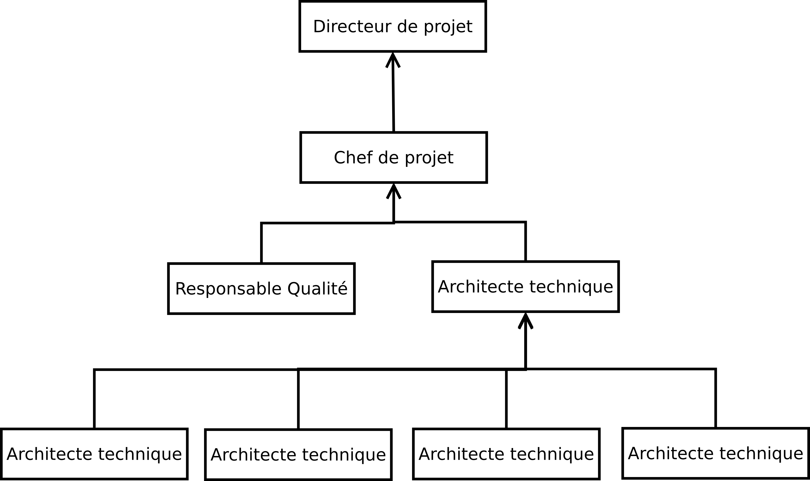

Plan de Management de Projet : Draft
____________________________________

.. contents:: Sommaire
.. sectnum::

Introduction
------------

Ce document constitue le plan de management (gestion) du projet "Monitoring à
distance de sites isolés".

Ce projet est réalisé par l'équipe H4314 à la demande de COPÉVUE, représenté
par MM. Régis Aubry et Marian Scuturici.

Le document qui suit fera l'objet de plusieurs révisions et publications.
Veuillez vous reporter au dépôt *Git* du projet pour obtenir la version la plus
à jour ou consulter ses différentes révisions.

Ce document formalise les méthodes et outils utilisés pour organiser, suivre et
gérer le projet durant toute son application.

Modalités de gestion du document
--------------------------------

Ce document peut être modifié pendant le projet afin de tenir compte des
nouvelles orientations qui peuvent être prises pendant le projet ou affiner
certains aspects. Chaque nouvelle révision publiée implique une notification
par e-mail de l'équipe du projet qui devra se tenir au fait des éléments mis à
jour.

Présentation du projet
======================

Contexte
--------

Ce projet fait suite à l'appel d'offre émis par l'organisme COPÉVUE. Le groupe
d'étude H4314 a présenté le 27 janvier 2011 une réponse à cet appel d'offre qui
a été retenue.

Ce projet s'étend sur l'intégralité de l'année 2011 et sera progressivement
déployé lors du premier trimestre de 2012 par nos équipes pilotée par COPÉVUE.

Notre objectif et de concevoir, réaliser et implémenter un système de
monitoring à distance de cuves de liquides sur des sites isolés à travers
l'Europe. Ce projet sera réalisé par une équipe pluri-compétente, qui devra
maîtriser plusieurs disciplines :

* l'électronique et de l'architecture de systèmes embarqués,
* la programmation informatique dans les domaines du système embarqué, la
  gestion de l'information, la réalisation d'applications à destination
  d'utilisateurs finaux avec IHM sur client léger (web),
* les réseaux et télécoms, et plus particulièrement les réseaux sans fils et
  mobiles.

Le projet intègre trois composantes majeures :

* un système électronique indépendant capable d'effectuer des mesures dans
  des cuves de liquide réparties sur un site et ses composants logiciels,
* un système central de collecte et de manipulation des données capable de
  collecter les données mesurées sur les sites, essentiellement constitué de
  briques logicielles.
* les outils de communication entre le site central et les sites industriels
  distants.

Le système central sera réalisé dans une démarche de conception d'un progiciel
afin d'être constitué de briques logicielles indépendantes et modulables. Nous
ne pouvons en effet pas prévoir les outils qui devront être développés pour
traiter les données collectées.

Le périmètre du projet admet les limites suivantes :

* la mise en place d'une infrastructure matérielle pour le système central,
  qui sera à la charge de COPÉVUE ou des prestataires de son choix,
* le traitement d'autres données que celles émises par les capteurs des
  cuves.

Organisation du travail
-----------------------

Chef de projet et coordinateur
==============================

Le projet est dirigé par Martin Richard qui organisera, planifiera et
coordonnera le travail à réaliser par les membres de l'équipe du projet.

En cas d'indisponibilité du chef de projet, les membres de l'équipes doivent se
reporter au directeur de projet ou aux experts techniques qui seront désignés
lors de la réunion de pré-lancement en semaine 5.

Responsable Qualité, Méthode, Documentation
===========================================

Etienne Guerin sera responsable de la qualité du projet, des méthodes et de la
documentation. Il devra :

* collecter, rédiger et assurer la diffusion des méthodes de travail mises en
  place dans le cadre de du projet,
* s'assurer de la cohérence du travail réalisé par les différentes équipes, à
  l'aide des experts techniques,
* maintenir à jour et organisée la documentation et la gestion de la
  configuration du projet.

Le responsable de la qualité devra maintenir la synchronisation entre les
méthodes de travail appliquées dans le cadre du projet et les méthodes mises en
place au sein de l'entreprise.

Groupe d'Étude
==============

Le groupe d'étude est composé de quatre pôle d'expertise, qui seront chacuns
dirigés par un expert technique.

Yoann Buch occupera le rôle d'architecte technique du projet. Il sera en charge
de l'élaboration et du maintien de l'architecture globale du système,
s'assurera de la cohérence des réalisations des équipes d'expertise et
travaillera sur les interfaces mises en place entre les différents
sous-systèmes.

Chaque expert technique interviendra pour étudier la conception détaillée des
sous-systèmes selon son domaine d'expertise, sous la supervisation de
l'architecte technique.

Génie Électronique
~~~~~~~~~~~~~~~~~~

L'équipe Génie Électronique sera dirigée par Arturo Major. Elle développera les
solutions techniques embarquées et des pilotes (*Drivers*) qui seront mis à la
disposition de l'équipe Génie Logiciel.

L'équipe est composée de trois personnes.

Génie Logiciel
~~~~~~~~~~~~~~

L'équipe Génie Logiciel sera dirigée par Paul Adenot. Elle réalisera le
micro-logiciel intégré au système de mesure embarqué, le progiciel de gestion
de données du site central et les logiciels clients.

L'équipe est composée de quatre personnes.

Sciences de l'information
~~~~~~~~~~~~~~~~~~~~~~~~~

L'équipe Sciences de l'information sera dirigée par Yi Quan Zhou. Cette équipe
aura devra développer les procédures, outils et algorithmes permettant de
stocker, trier et manipuler les données collectées sur les différents sites.
Cette équipe devra notamment traiter les problématique de mise à l'échelle du
système central et l'élabortation d'outils d'aide à la décision et de
statistiques.

L'équipe est composée de deux personnes.

Télécoms et réseaux
~~~~~~~~~~~~~~~~~~~

L'équipe Télécoms et réseaux sera dirigée par Pierrick Grandjer. Cete équipe
travaillera a l'élaboration des protocoles de communication utilisés dans le
système et la mise en place des réseaux et sous-réseaux qui devront être
déployés sur les sites.

Cette équipe sera également charger d'effectuer des audits des infrastructures
de communications en place à l'échelle européenne.

L'équipe est composée de deux personnes.

Schéma récapitulatif
~~~~~~~~~~~~~~~~~~~~

La maîtrise d'ouvrage interviendra lors des commités de pilotage et validation
du projet aurpès des directeur et chef de projet ou de l'architecte technique.

Un responsable technique d'équipe peut prendre part à une réunion avec la
maîtrise d'ouvrage si l'ordre du jour le concerne.
Démarche de développement
-------------------------

Cycle de vie
============

Ce projet sera développé en plusieurs lots et plusieurs phases.

Découpage du projet
===================

Ce qui suit est une série de listes hierarchisées décrivant le projet selon
plusieurs points de vue.

Approche organisationnelle/fonctionnelle :
~~~~~~~~~~~~~~~~~~~~~~~~~~~~~~~~~~~~~~~~~~

* Électronique/Système embarqué

  * Étude des capteurs
  * Étude de l'architecture du système embarqué (analyse des solutions
    retenues pendant l'étude préalable)
  * Étude du protocole et du type de communication entre le capteur et le
    système
  * Réalisation de tests de performance, autonomie, résistance
  * Étude des limites techniques de la solution

* Logiciel

  * Micro-logiciel embarqué
  * Logiciel du système *maître* sur site
  * Progiciel *mainframe* du site central
  * Logiciels d'exploitation utilisateurs

    * Interfaces pour appareils mobiles et terminaux légers (techniciens
      intervenant sur site)

      * Interfaces Homme-Machine
      * Logique métier

    * Logiciels de traitement des données collectées (Aide à la décision,
      statistiques)

      * Interfaces Homme-Machine
      * Implémentation de la logique métier

* Télécom et réseau

  * Étude de la fiabilité des échanges entre le capteur et le système
  * Étude critique des outils de communication GPRS (performances, capacités,
    limites)

  * Étude de la sécurisation des transmission des données sur le(s) réseaux
  * Étude des infrastructures de télécommunication mises en place en Europe
    et utilisable pour déployer les systèmes.

* Sciences de l'information

  * Collecte des besoins des clients, analyse de l'existant, analyse des
    fonctions supports
  * Gestion des données, stockage

    * Analyse des solutions existantes
    * Mise à l'échelle (capacité à traiter un grand volume d'informations)

  * Aide à la décision

    * Étude d'algorithmes et euristiques
    * Mise à l'échelle

  * Statistiques

    * Étude des indicateurs courants
    * Élaboration de métriques
    * Mise à l'échelle

  * Monitoring

    * Analyse des outils de fouille de données
    * Classification des données
    * Mise à l'échelle

Approche produit :
~~~~~~~~~~~~~~~~~~

  * Système Embarqué de mesure

    * Prise de mesure
    * Normalisation de la mesure
    * Évaluation du niveau d'autonomie
    * Journalisation des anomalies
    * Communication avec le maître du site

      * Transmission de la mesure normalisée
      * Transmission des journaux d'anomalies
      * Transmission du niveau d'autonomie

  * Maître du site (Logiciel)

    * Identification et authentification des systèmes de mesure
    * Collecte des données des systèmes de mesure
    * Tri et compression des données
    * Encryptage et sécurisation des données
    * Communication des données au site central
    * Réception des paramètres de configuration depuis le site central
    * Configuration du système (paramètres de sécurité, adresses de confiance,
      certificats)
    * Configuration des systèmes de mesure (fréquences, etc)

  * Gestion des données centralisées

    * Collection des données

      * Réception
      * Stockage

    * Traitement et calcul

      * Traitements planifiés
      * Traitements sur demande

    * Analyse des données traitées
    * Contrôles de validité

    * Mise à jour des plannings d'intervention
    * Envoi de notifications au personnel

  * Logiciels utilisateurs (basés sur des briques d'un progiciel/framework
    commun)

    * Brique : Identification et authentification des utilisateurs
    * Logiciels pour terminaux mobiles

      * Consultation de planning d'intervention
      * Consultation de la feuille de route
      * Consultation de l'état des infrastructures
      * Consultation de l'annuaire de contacts partagé
      * Édition d'un relevé manuel de données
      * Édition d'une demande d'intervention (remontée manuelle d'une anomalie)

    * Logiciels de supervisation

      * Surveillance du site central
      * Surveillance des sites distants
      * Configuration du site central
      * Configuration des sites distants
      * Analyse des plannings d'intervention
      * Monitoring des serveurs
      * Gestion des permissions
      * Gestion des certificats de sécurité
      * Déploiement de mises à jour

    * Logiciels de monitoring

      * Réception des statistiques 
      * Présentation en tableaux de données
      * Présentation en schémas
      * Éditions de synthèses
      * Requêtes utilisateurs

        * Fouille des données
        * Aide à la décision

Planning prévisionnel
=====================

::

  TODO

Supports méthodologiques et moyens à mettre en oeuvre
-----------------------------------------------------

Moyens matériels
================

L'équipe a sa disposition le budget nécessaire pour acquérir le matériel
spécifique qui lui est nécessaire pour réaliser les prototypes les plus
aboutis. La validation d'un budget est effectuée par le directeur de projet.

Les membres de l'équipe auront à leur disposition leurs postes de travail
habituels fournis par l'entreprise :

  * un ordinateur portable par personne, une station d'accueil fixe,
  * un serveur (physique) pour mettre en place la recette et l'intégration,
  * l'infrastructure de l'entreprise (réseau, imprimantes, etc)

Moyens logiciels
================

Nous utilisons essentiellement des logiciels open-source. L'entreprise
n'accordera pas de budget pour l'achat de licences pour le(s) système(s)
d'exploitation, logiciels de bureautique ou de gestion de projet.

L'achat de licences et de logiciels spécifiques au projet sera validé par le
directeur de projet.

Les outils et services mis à disposition pour le projet :

 * Un compte *Organizations Pro* sur Github.com,
 * Une installation de *Redmine* sur les serveurs de l'entreprise,
 * Un compte *Google Pro Accounts* offrant un accès complet aux services
   Google (gmail, docs, etc) pour chaque membre de l'équipe.

Moyens Humains
==============

La composition de l'équipe est décrite dans le chapitre 3.

Si nécessaire, les membres pourront participer à des formations aux logiciels,
matériels et outils spécifiques au projet qui seront manipulés par l'équipe.

Une formation au protocole Zigbee est planifiée pour l'équipe télécom, une
formation au système d'exploitation du système embarqué est prévue pour
l'équipe génie logiciel.

Évaluation de la charge
~~~~~~~~~~~~~~~~~~~~~~~

La charge de travail sera évaluée par le chef de projet avec l'assistance de
l'architecte technique et des experts.

Pour chaque tâche, le chef de projet se référera aux procédures standard de
l'entreprise pour évaluer les charges pour les tâches de tests, revue,
correction et validation.

Chaque membre de l'équipe reportera son activité et son temps de travail sur l'outil *Redmine*.

Réalisation du bilan humain
~~~~~~~~~~~~~~~~~~~~~~~~~~~

Chaque membre de l'équipe effectuera un bilan personnel en fin de mois par le
biais des sondages réalisés par le directeur de projet.

Chaque responsable d'équipe fera une révue hebdomadaire avec son équipe,
précédant la revue avec le chef de projet, l'architecte technique et le
responsable qualité.

Chaque mois, une réunion d'une demi-journée sera organisée pour faire un point
avec l'intégralité des membres du projet. L'ordre du jour de la réunion sera
fixé par le chef de projet.

Des séminaires de *team building* seront financés par l'entreprise chaque
semestre (soirée restaurant, activités ludiques) pour favoriser la
communication dans l'équipe.
Gestion de la configuration
===========================

La gestion de configuration sera supportée par les outils de gestion de
versions utilisés à l'échelle du projet (*git* et *github*).

Maîtrise de la configuration
----------------------------

Les modificatiosn du plan de configuration seront soumises à discussion au
comité de pilotage du projet. Le projet sera découpé en de nombreuses
itérations successives afin d'intégrer ces modifications à la feuille de route
du projet. Ainsi, le projet sera géré de manière agile.

Enregistrement des états de la configuration
--------------------------------------------

La politique de révision du document sera formalisée par le responsable
qualité.

D'un point de vue applicatif, l'utilisation des branches et *tags* permettant
d'organiser les révisions des documents dans un dépôt seront utilisés.

Audit et revue
--------------

L'infrastructure de l'entreprise et les services auxquels nous avons souscrit
permettent d'assurer une traçabilité et une sauvegarde efficace et fiable des
documents produits.

L'intégrité du référentiel de configuration sera vérifiée à chaque itération
par le chef de projet et le responsable qualité.

Le chef de projet tiendra à jour une matrice de couverture
exigences-réalisations qui sera mis à jour à chaque validation finale d'une
tâche.

Gestion des risques
===================

Ce qui suit ne liste que les principaux risques identifiés.

Risques humains
---------------

Problèmes de compétences
  des formations sont prévues

Problèmes de disponibilité
 le projet va s'étendre sur plus d'une année, il est donc probable que certain
 membres de l'équipe soit indisponibles pour un temps, ou quittent l'entreprise.
 Le chef de projet veillera à répartir les tâches critiques entre plusieurs
 acteurs, tandis que le responsable qualité veillera à la bonne documentation de
 l'ensemble du projet.

Risques économiques
-------------------

Dépendance vis à vis des fournisseurs
  certains outils et produits édités par nos fournisseurs peuvent être
  indisponibles ou ne plus être produits. L'équipe s'assurera que nos
  fournisseurs assureront un support de leurs produits à long terme (mise à jour
  du système d'exploitation embarqué, utilisation de protocoles et formats
  récents pour le matériel).

Risques techniques
------------------

Dépendance à des infrastructures non maîtrisables
  la communication longue distance entre les sites distants et le site central
  impliquent l'utilisation d'infrastructures gérées par des entreprises externes.
  Leur fiabilité n'est donc pas de notre ressort. Cette contrainte est clairement
  identifiée dans les spécifications techniques des besoins et est donc prise en
  compte dans la conception et réalisation du projet.

Contraintes imprévues
  certains sites peuvent être soumis à des conditions imprévues qui ne sont pas
  supportés par les capteurs (météo, propriétés chimiques des produits dans les
  cuves). La dépendance entre le modèle de capteurs et le système doit être
  faible.

Risques contractuels
--------------------

Le système sera déployé à travers l'Europe
  les normes et lois en vigueur ne sont pas identiques d'un pays à l'autre.
  L'architecte et les experts effectueront une veille régulière sur ce sujet.
