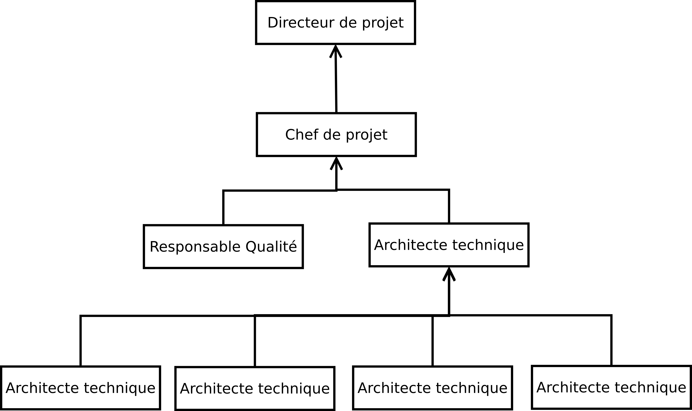

Organisation du travail
-----------------------

Chef de projet et coordinateur
==============================

Le projet est dirigé par Martin Richard qui organisera, planifiera et
coordonnera le travail à réaliser par les membres de l'équipe du projet.

En cas d'indisponibilité du chef de projet, les membres de l'équipes doivent se
reporter au directeur de projet ou aux experts techniques qui seront désignés
lors de la réunion de pré-lancement en semaine 5.

Responsable Qualité, Méthode, Documentation
===========================================

Etienne Guerin sera responsable de la qualité du projet, des méthodes et de la
documentation. Il devra :

  * collecter, rédiger et assurer la diffusion des méthodes de travail mises en
    place dans le cadre de du projet,
  * s'assurer de la cohérence du travail réalisé par les différentes équipes, à
    l'aide des experts techniques,
  * maintenir à jour et organisée la documentation et la gestion de la
    configuration du projet.

Le responsable de la qualité devra maintenir la synchronisation entre les
méthodes de travail appliquées dans le cadre du projet et les méthodes mises en
place au sein de l'entreprise.

Groupe d'Étude
==============

Le groupe d'étude est composé de quatre pôle d'expertise, qui seront chacuns
dirigés par un expert technique.

Yoann Buch occupera le rôle d'architecte technique du projet. Il sera en charge
de l'élaboration et du maintien de l'architecture globale du système,
s'assurera de la cohérence des réalisations des équipes d'expertise et
travaillera sur les interfaces mises en place entre les différents
sous-systèmes.

Chaque expert technique interviendra pour étudier la conception détaillée des
sous-systèmes selon son domaine d'expertise, sous la supervisation de
l'architecte technique.

Génie Électronique
~~~~~~~~~~~~~~~~~~

L'équipe Génie Électronique sera dirigée par Arturo Major. Elle développera les
solutions techniques embarquées et des pilotes (*Drivers*) qui seront mis à la
disposition de l'équipe Génie Logiciel.

L'équipe est composée de trois personnes.

Génie Logiciel
~~~~~~~~~~~~~~

L'équipe Génie Logiciel sera dirigée par Paul Adenot. Elle réalisera le
micro-logiciel intégré au système de mesure embarqué, le progiciel de gestion
de données du site central et les logiciels clients.

L'équipe est composée de quatre personnes.

Sciences de l'information
~~~~~~~~~~~~~~~~~~~~~~~~~

L'équipe Sciences de l'information sera dirigée par Yi Quan Zhou. Cette équipe
aura devra développer les procédures, outils et algorithmes permettant de
stocker, trier et manipuler les données collectées sur les différents sites.
Cette équipe devra notamment traiter les problématique de mise à l'échelle du
système central et l'élabortation d'outils d'aide à la décision et de
statistiques.

L'équipe est composée de deux personnes.

Télécoms et réseaux
~~~~~~~~~~~~~~~~~~~

L'équipe Télécoms et réseaux sera dirigée par Pierrick Grandjer. Cete équipe
travaillera a l'élaboration des protocoles de communication utilisés dans le
système et la mise en place des réseaux et sous-réseaux qui devront être
déployés sur les sites.

Cette équipe sera également charger d'effectuer des audits des infrastructures
de communications en place à l'échelle européenne.

L'équipe est composée de deux personnes.

Schéma récapitulatif
~~~~~~~~~~~~~~~~~~~~

La maîtrise d'ouvrage interviendra lors des commités de pilotage et validation
du projet aurpès des directeur et chef de projet ou de l'architecte technique.

Un responsable technique d'équipe peut prendre part à une réunion avec la
maîtrise d'ouvrage si l'ordre du jour le concerne.
