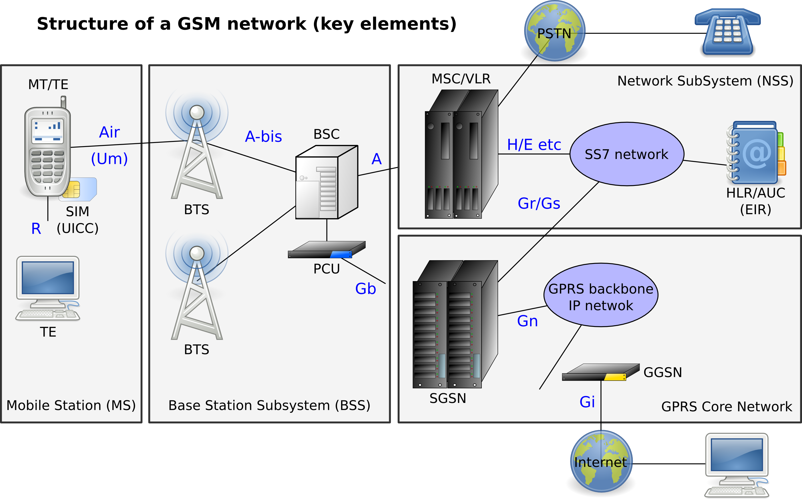
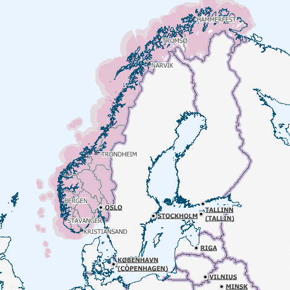

======================
Dossier de faisabilité
======================

.. contents:: Sommaire
    :depth: 2
.. sectnum::

Ce document présente, de manière succincte, l'existant, ses points forts et ses
points de faiblesses, une étude de faisabilité par rapport aux technologies
émergentes et fiables. Il donne par ailleurs quelques pistes d'évolution.

Introduction
##############

Problématique
=============

De nombreuses régions d'Europe sont faiblement déservies pour des raisons :

* démographiques, le faible peuplement de ces zones fait que les infrastructures de transport sont peu développées ;
* géographiques, certaines de ces zones sont difficilement accessibles par la difficulté et le coût d'installation d'infrastructures.

Cependant ces régions ne sont pas pour autant vides ni inexploitées. En effet, sont constatées de nombreuses stations de travail dédiées à diverses activités :

* abattage de bois
* installation de réseaux (électriques ou de télécommunications)
* étude de la faune et de la flore
* ...

D'autres stations, considérées comme passives, sont à inclure :

* stations de pompage
* cuves 
  * liquide anti-incendie (fortement présentes dans les régions à haut risques comme la méditerranée)
  * carburant
  * déchet
* ...

La problématique réside ici à la capacité d'autonomie des stations isolées (en
énergie, déchets, présence humaine, etc.).  Ces stations doivent être
régulièrement surveillées pour veiller à un fonctionnement optimale tout en
évitant les risques environnementaux.  Ces visites permettent de s'assurer que
les stations sont bien ravitaillées, nettoyées, vidées et fonctionnelles.

Analyse de l'existant
#######################

Analyse du métier
===================

Pour cette étude de l'existant, comme pour le reste de cet appel d'offre, seront
visées uniquement les stations réservoirs utilisées pour stocker des liquides
(eau, carburant, autre substance) ou bien des déchets

Cet appel d'offre partant d'une initiative scandinave, l'analyse de du
fonctionnement actuel dans dans cet région s'impose et sera un échantillon
représentatif de ce qu'il se fait en Europe.


Analyse des savoir-faire et des processus
===========================================

En Scandinavie, une centaine de sites ont été répertoriés avec pour chacun une
présence moyenne de 10 cuves réparties dans un rayon de 100 mètres. Actuellement
la gestion ces sites distants n'est pas centralisée et il n'est pas possible de
connaître à distance l'état des cuves/réservoirs. Aucun organisme spécifique ne
s'en occupe. La surveillance est assurée par ses utilisateurs ou le propriétaire
des lieux. Ceux sont eux qui, en fonction de l'état de la cuve, prévienne
l'organisme chargé de s'occuper des réservoirs que ce soit pour effectuer une
réparation ou bien pour vider ou ravitailler la cuve.

Les organismes chargées de la maintenance des réservoirs s'occupe donc, en
interne, ou via un prestataire de services externe, d'affréter un camion pour
effectuer ces opérations. Parmi ces organisations peuvent être comptées des
particuliers ou bien des organismes d'état (mairies, pompiers, communauté de
communes, organisme de gestion des forêts, etc.). Les particuliers
s'occupe eux mêmes de la surveillance et contactent directement les prestataires
de services. Quand aux organismes d'état ils affectent des opérationnels chargés
de la surveillance et ont parfois la capacité en interne de maintenir ses sites.
Cependant pour la majeure partie des cas, ils externalisent ces convois de
maintenance à des sociétés privées.

Les opérationnels sont chargés de vérifier l'état de fonctionnement des
stations. Il effectue régulièrement des visites de manière hebdomadaire pour
certaines à plusieurs mois suivant le niveau de criticité et d'utilisation.  Une
des opérations principales revient à vérifier manuellement le niveau du
réservoir. En effet, il n'existe aucun système électronique indiquant le niveau
de remplissage. Une simple constatation via l'ouverture de la cuve suffit.
Quelque fois la présence d'une sonde permet une précision plus fine. Si le
seuil, fixé et propre à la cuve, est atteint alors l'opérationnel le signale et
déclenche la demande de ravitaillement/enlèvement. Dans d'autre cas, la cuve
sera ravitaillée après chacune de ses utilisations pour s'assurer de son
remplissage maximal. C'est le cas des cuves dédiées au stockage d'eau et de
liquide pour lutter contre les incendies.

Il faut noter qu'entre une demande et l'opération de maintenance peuvent
s'écouler plus d'une semaine ou plus suivant les conditions affectant le
transport. La taille des cuves varie de 1 mètre cube à 20 mètres cube et influe
donc sur la fréquence des opérations de maintenance. Concernant les coûts de
transport, hors achat du contenant, ils sont généralement établies entre 1000€
et 3000€ selon la distance et la difficulté d'approche du site.

Discussion sur l'adéquation de la solution actuelle
====================================================

Cette décentralisation de la surveillance des sites isolés est source de
nombreux dysfonctionnements qui peuvent être déclinés en deux grandes catégories : 
un gaspillage financier (argent provenant pour la majorité des cas des
contribuables) et un risque environnemental important, non contrôlé.

Plusieurs facteurs sont sources de gaspillage financier :

 * La logistique. Il n'existe pas de planification globale et donc pas d'optimisation dans les livraisons/enlèvements de contenant et systématiquement un camion se retrouve avec un chargement nul sur un des trajets (l'aller ou le retour).
 * La surveillance. Celle-ci est effectuée par des opérationnels et est donc fortement coûteuse, en particulier lorsque l'on constate que la majorité des déplacements ne débouche sur aucune opération de maintenance. Il s'agit donc d'une monopolisation des ressources humaines pour une tâche sans réelle valeur ajoutée par rapport à ce qu'elles pourraient apporter.
 * Une surveillance non globale. L'éparpillement de la gestion de ces sites empêchent de faire des économies d'échelles à de nombreux niveaux que ce soit au niveau de la surveillance ou bien dans la mise en commun des achats de contenant ou de services de transport.

De nombreux points favorisent les risque environnementaux :

 * Oublis. Le système reposant uniquement sur des ressources humaines, de nombreux oublis de ravitaillement de cuves ont été constatés. C'est totalement inacceptable pour des cuves stratégiques comme celle dédiée à la lutte des incendies.
 * Fuites. En plus d'être une perte financière, les fuites, suivant le contenant de la cuve, peuvent s'avérer très dangereux écologiquement. Le problème est que ces fuites sont constatées bien souvent trop tard du fait d'une surveillance manuelle, souvent fortement espacée dans le temps.

De manière générale, il manque une traçabilité des opérations effectuées par les divers acteurs et ne permet donc pas un monitoring global.

Étude de faisabilité 
####################

Synthèse sur Système embarqué
=============================

Solution 1 : Solution tout intégré à base de chip Ember
```````````````````````````````````````````````````````

Ember est une société américaine crée en 2001, qui s'est spécialisé dans la
production et la commercialisation de solutions ZigBee. Membre de la Zigbee
Alliance, ses solutions sont reconnues pour leur efficacité et leur
interopérabilité.

Elle propose en ensemble de solutions intégrée à base de microcontrôleurs ARM,
comportant des mémoires flash et RAM, pouvant fonctionner sur secteur ou
batteries, avec une grande durée de vie. Le système est conçu pour être intégré
avec des périphérique externe, et propose par la même un grand nombre de
convertisseurs analogique-numériques, permettant de brancher une grande variété
de capteurs (Nom commercial EM250).

Les produits Ember sont conçus pour fonctionner dans des environnements variés.
Il est aussi possible de n'utiliser que le coprocesseur réseau Ember, et de le
coupler avec un processeur d'un autre fabricant, afin de bénéficier de plus de
flexibilité quant au choix des composants (Nom commercial EM260). 

Les solutions Ember sont capables de fonctionner en réseau de type maillé, et
proposent une porté en extérieur d'environ 100m. La consommation est très basse
(40mA en émission/réception, pour 1 à 1.5µA en mode veille), ce qui assure un
fonctionnement sur batterie de longue durée.

Ember a conçu un environnement de développement intégré, adapté à ses produits
(aussi bien ceux de type System on Chip (SoC) tout intégré que les solutions plus
modulaires), qui sont conçus pour le développement et le débogage
d'applications réseau maillée, et propose donc des outils spécifiquement
adaptés.

Il est possible d'acquérir des kits de tests, peu onéreux, qui sont
spécifiquement conçus pour que des ingénieurs testent des solutions dans leur
environnement spécifique, pour s'assurer de l'adéquation du matériel avec la
résolution de leur problème.

Solution 2 : Solution tout intégrée à base de chip Atmel
````````````````````````````````````````````````````````

Atmel est une entreprise américaine, basée en Californie, qui conçoit et
fabrique des semi-conducteurs depuis 1984.

Cette entreprise des solutions pour plusieurs corps de métier (Domotique,
applications industrielles, solutions d'éclairage automatisée, solutions pour
capteurs, etc.).

Elle propose, tout comme Ember, un ensemble de solutions intégrées, ou à intégrer,
afin d'avoir une plus grande flexibilité, les composants étant standards. La
plupart des solutions proposent des fonctionnalités de communication sans-fil
(ZigBee) et des convertisseurs, afin de brancher des capteurs. Un mode de veille
profonde est supporté, afin de baisser la consommation jusqu'à 250 nA
(le minimum de composants sont alimentés, et un timer tourne pour savoir quand
repasser dans autre mode). Cela permet une durée de vie extrêmement longue.

L'environnement de développement se base sur Eclipse, et est donc portable sur
Windows, Linux et MacOS, tout en assurant une bonne intégration avec les
solutions matérielles.

Comme pour la solution Ember, il est possible d'acheter, pour environ $400, un
kit comprenant 5 ATmega1281V (microcontrôleurs) et 5 AT86RF230 (transmetteurs
sans fils), ainsi que les logiciels pour mettre en œuvre une solution de
démonstration de type réseau maillé.


Solution 3 : Solution tout intégrée module XBee-Pro Digimesh
````````````````````````````````````````````````````````````

Digi International est une société américaine fondée en 1985 et basée dans le Minnesota.
Elle développe des solutions permettant la mise en réseau d'équipements divers en utilisant
les réseaux cellulaires ainsi que présentant une compatibilité ZigBee et Wifi.

Digi présente ses équipements comme étudiés pour être utilisés en environnement
dangereux, tels que les usines chimiques ou les entrepots de matières inflammables.

Digi propose un kit de développement pour 270 dollars et des modules XBee pour 20
dollars pièce.

Le module XBee 900 n'est pas autonome, il nécessite d'être connecté à un ordinateur.
Le nombre de capteurs possible n'est donc pas limité par cette technologie.


Solution 4 : Intégration manuelle de composants
```````````````````````````````````````````````

En dehors des solutions toute intégrées, il est envisageable d'intégrer des
composants de différents constructeurs, par exemple, un microcontrôleur, un
périphérique réseau, des capteurs, un système temps réel, pour former une
solution calquée sur les besoins.

Un tableau de synthèse est disponible en annexe, regroupant toutes les solutions
étudiées. Un second tableau de synthèse met en regard les différents systèmes
d'exploitation utilisables.

Synthèse sur gestion de l'énergie
==========================================

Le système de gestion du contenu d'un réservoir a besoin d'énergie pour alimenter les capteurs, le système embarqué et les équipements de communication. Le système doit pouvoir fonctionner en autonomie et de façon écologique au niveau énergétique. Pour palier ces besoin, nous avons étudié différents sources d'énergies.

Estimation des besoins d'énergie pour une station
```````````````````````````````````````````````````````````````
Dans une station, nous avons deux principaux consommateurs d'énergie: le chipset du système embarqué et le modem GSM/GPRS. 
Pour le chipset, nous avons trouvé un produit qui a une très bonne autonomie. La puissance à l'état repos est inférieur à 1 mW, qui est négligeable. Quand il est en émission ou en réception, la puissance ne dépasse pas 0,1 Watt. 
En ce qui concerne le modem, la puissance au repos est d'ordre 0,1 Watt et celle en émission/réception est au maximum 3 Watt.
En conséquence, une alimentation de 12V et 5 Watt est suffisant pour notre système. Si on estime que les équipement échange des données avec le serveur toutes les minute pendant 1 seconde, il faut 0.2 A*h d'électricité par jour ou 6 A*h par mois sous un voltage de 12 V. 

Pile
``````
La pile doit pouvoir fournir continuellement et pendant le maximum de temps l'énergie nécessaire au système embarqué et ses annexes. La pile ne doit pas avoir besoin des maintenances pour ajouter de l'électrolyte à l'acide. Dans le cas ou cette pile serait couplée à d'autres sources électriques, elle devrait se recharger.

Exemples de piles

==================  ===============================     ====================    ==============================
Caractéristique     Acker Drill Company Ace Battery     BA22NF Solar Battery    6 Volt Solar Panel Charger
==================  ===============================     ====================    ==============================
Prix                $169.95                             $191.95                 $24.95
Poids               54.5kg                              38.5Kg                  3kg
Taille              10.25*6.13*9.13 cm                  9.38*5.5*9.25 cm        6.0" x 3.5" x 0.75"
Voltage             12V                                 12V                     6V
Amperage/wattage    75A*h                               55A*h                   630mW
Référence           http://bit.ly/ehm2OG                http://bit.ly/fL36k7    http://bit.ly/hQRVVU
Remarques           Pas besoin de maintenance           Garantie 1 an           Garantie 1 an, étanche.
==================  ===============================     ====================    ==============================

Énergie solaire
``````````````` 

L'utilisation de panneaux solaires est favorable dans des
régions méditerranéennes. On peut faire coupler avec des piles qui se rechargent
lors que les panneaux solaires fournissent plus que les besoins du système. Dans
le cas contraire, elles fournissent le manque. Aujourd'hui, les technologies de
panneaux solaires sont assez développées et que la durée de vie dépasse 20 ans.
Les petits panneaux fonctionnent dans toutes les conditions météo.

Dans les pays nordique où l'ensoleillement est moins par rapport à d'autre
région, les panneaux solaires peuvent également fonctionner. En Norvège par
exemple, depuis les années 1970, les panneaux photovoltaïques ont été
fréquemment utilisés pour produire de l'électricité dans les coins reculés non
raccordés au réseau électrique: chalets en montagne et près de la mer, phares et
installations techniques. Plus de 2000 phares de la côte norvégienne
s'alimentent en énergie solaire !

=================== ==================== =====================  ==================
Caractéristiques    Bp Sx305M            Power Up Bsp-112       OEM Solar Panel                               
=================== ==================== =====================  ==================
Prix                $47.58               $28.99                 $103.45                   
Taille              269 * 251 * 23mm     98 x 238 * 16mm        537*1200*46 mm                      
Wattage             5W                   1W                     5W                 
Voltage             12V                  16V                    12V                  
Référence           http://bit.ly/fA5KmP http://bit.ly/h4KWIs   -                                                       
Remarque                                                        Garantie 10 ans
=================== ==================== =====================  ==================

Énergie éolienne
`````````````````
L'implantation éolienne nécessite la présence d'un vent régulier et d'un terrain
approprié. Cette solution coût relativement cher et demande des intervention de
maintenance régulière. 

Exemple d'éolienne
    Éolienne 400W terrestre
    799€
    400 W (Puissance nominale à 45 km/h)
    100 W (Puissance nominale à 27 km/h)
    http://bit.ly/h3PqTC

Énergie géothermique
``````````````````````
A présent, il n'existe pas d'équipement de taille que l'on souhaite pour fournir
de l'électricité à notre système. Cette source d'énergie est dans la plus part
de temps utilisée pour chauffer la maison directement grâce à des pompes à
chaleur. La machine la plus petite qu'on a trouvé sur internet qui peut
transformer l'énergie géothermique en électricité possède une puissance de 3 kW.
Mais on peut envisager l'utilisation de cette énergie dans un futur proche pour
notre système.

Conclusion
```````````
Notre solution pour l'alimentation des station en énergie se base sur
l'utilisation des piles et des panneaux solaires. Nous pouvons choisir des
panneaux solaires plus ou moins grands et des piles de capacité plus ou moins
importantes selon la condition climatique de la région. 

Synthèse sur capteurs
==========================================
Dans le cadre de notre étude, les capteurs peuvent faire l'objet d'une classification par type de sortie.
Ils peuvent être de type : analogique, numérique ou logique (TOR).
La difficulté est donc la multiplicité des données en sortie de chaque capteur.
Il faudra utiliser une carte d'acquisition afin d'obtenir les mêmes données de sorties, quel que soit le capteur utilisé.
Cette carte a pour rôle de réaliser l'interface entre les capteurs et le système embarqué. 
La carte est composée :

- D'une carte électronique reliée aux capteurs et au système embarqué. Elle sera chargée d'effectuer les traitements de base sur le signal, afin de les transmettre de manière exploitable au système embarqué, en particulier lorsque ce qu'il faut contrôler nécessite l'exploitation de mesures provenant de plusieurs capteurs.
- D'un logiciel dédié au traitement des informations, installé sur le système embarqué. Il sera chargé de recevoir et garder les données envoyées par les capteurs.

Un moyen d'envoyer les données vers un équipement centralisé de gestion des capteurs d'une zone est la transmission radio.
Il existe en effet des équipements capables d'interfacer la carte d'acquisition et pouvant être connectés à un émetteur radio qui transmet les mesures au système embarqué.
La centrale sera connectée à un module équipé d'un modem GPRS.

Solution 1 : OTT RLS (Radar Level Sensor)
`````````````````````````````````````````
OTT FRANCE est la filiale française du groupe OTT Messtechnik.

L'activité s'étend de la fourniture de capteurs hydrométéorologiques à
l'installation complète de réseaux de mesure, avec les équipements suivants:

- Capteurs de mesure de hauteur, de vitesse d'écoulement et de débit, de précipitations et de qualité des eaux - système d'acquisition de mesures.
- Systèmes de transmission de données permettant l'utilisation des vecteurs de communication tels que modems RTC et GSM, radio, satellite.
- Logiciels de communication et de traitement.

Elle propose le produit OTT RLS (Radar Level Sensor), qui est un capteur radar
pour la mesure sans contact du niveau des eaux de surface. Il utilise la
technologie à impulsions radar pour déterminer le niveau de l'eau.

Pour que les impulsions radar émises atteignent la surface de l'eau, OTT RLS est
placé directement au-dessus du niveau d'eau à mesurer.  Étant donné que le
capteur est placé hors d'eau, les problèmes de mesures liés à la présence de
végétation ne peuvent pas apparaître. Le RLS couvre une plage de mesure allant de
0,8 à 35 m. Les interfaces standard permettent le raccordement d'autres capteurs
et la communication avec différents enregistreurs et systèmes de
télétransmission.  Compact et insubmersible, le RLS ne nécessite qu'une
maintenance réduite et bénéficie d'une longue durée de vie. Sa consommation
réduite et son design bien pensé font de ce produit une alternative économique,
pratique et fiable aux appareils de mesure de hauteur d'eau classiques.

Reférences :
    http://www.hydrolab.com/web/ott_hach.nsf/id/pa_radar_level_sensor.html
    http://www.ottfrance.com/web/ott_fr.nsf/id/pa_rls_fr.html

Solution 2 : Capteur VEGAPULS 62 
````````````````````````````````
Depuis plus de 50 ans, VEGA s’investit dans une politique active de
développement de la mesure de niveau et de pression. Tous ses capteurs sont
fabriqués en Allemagne et en France selon les normes ISO 9000 et ISO 14001 avec
une exigence permanente de très haute qualité, ce qui leur permet d'offrir 3
ans de garantie.

Elle nous propose le capteur radar VEGAPULS 62 qui mesure le niveau des liquides
dans des conditions difficiles. Le capteur radar VEGAPULS 62  maîtrise
facilement des conditions d'acquisition difficiles comme les températures extrêmes,
la surpression ou le vide. Le capteur mesure le niveau du liquide dans les cuves
de stockage et les réservoirs, également à une température de -200 °C à +450 °C.

Grâce à la technologie radar, le capteur de niveau mesure le niveau des liquides
sans contact et fournit en continu des valeurs de mesure très précises.

Référence: 
    http://www.vega.com/fr/Mesure_de_niveau_Radar_VEGAPULS62.htm

Conclusion
```````````
Notre solution pour les capteurs se base sur différentes caractéristiques, 
qui sont principalement : Précision de mesure, Tension d'alimentation et prix.
Nous pouvons choisir le capteur OTT RLS car nécessite qu'une maintenance réduite 
et bénéficie d'une longue durée de vie. Sa consommation réduite et son design bien 
pensé font de ce capteur une alternative économique, pratique et fiable par rapport 
aux appareils de mesure de hauteur d'eau classiques.

Synthèse systèmes de communication
==================================

Problématique
`````````````
Cette étude a pour objectifs d'effectuer un état de l'art en termes de communication longue distance. En l'occurence, ici, il s'agit de trouver des solutions potentielles permettant de répondre à la question suivante : *comment s'effectuera la communication entre les sites distants et le site central de monitoring ?*

Pour répondre à cette question, il convient dans un premier temps de rappeller les contraintes inhérentes :
 * le site central pourra être déployé (voir migré à tout moment) partout en Europe, et a forciori n'importe où dans le monde.
 * les sites distants sont situés n'importe où en Europe, y compris les endroits les plus reculés et les moins bien desservis, que ce soit en terme de d'énergie, de télécommunications ou d'infrastructures routières.
 * la communication devra être fiable
   * les informations ne doivent pas être perdues
   * certaines stations critiques doivent inclure des capacité de reprise ou de capacité de redondance pour garder une disponibilité maximale
 * la communication doit être la moins coûteuse possible
 * le matériel devra supporter des conditions climatiques extremes

Dans un deuxième temps, les critères de selection d'une solution se porteront également sur la teneur des communications : *quelles données seront amenées à circuler dans un sens, comme dans l'autre ?*

Du site central vers les sites distants :

* mises à jour des logiciels (fréquence : maximum toutes les semaines, mais certainement beaucoup plus espacé)

Des sites distants vers le site central :

* les informations provenant des capteurs (fréquence : de l'ordre de la minute)

Enfin, la taille du réseau est à prendre en compte, nous partirons d'une base de simulation 10 fois plus importante que l'existant scandinave, soit :

* 100 sites distants x 10 = 1000 sites distants
* 1000 sites distants x 10 cuves = 10000 cuves

Solutions possibles
```````````````````
A l'heure actuelle trois méthodes de communication longue distante peuvent être envisagées pour ce système :

* par le réseau GPRS (2G+), autrement dit par le réseau GSM et internet
* par le réseau GPS, autrement dit par satellite
* par courant porteur libre, autrement dit par les lignes électriques

Détails des solutions
`````````````````````
Utilisation du réseau GPRS
--------------------------

Cette solution nécessite l'utilisation du réseau des télécommunications GSM. Le réseau GPRS est en réalité une extension s'appuyant sur le réseau GSM et a l'avantage d'une part de pouvoir rester connecté et d'autre part d'utiliser en plus des canaux de type voix, une passerelle vers le réseau internet. La facturation ne se fait non plus à la durée mais au débit.

Architecture du réseau GSM/GPRS




Les prérequis sont :

* être à portée d'une antenne de télécommunication (BTS)
* nécessite un abonnement auprès d'un FAI/opérateur téléphonique? Donc un abonnement par site distant ? 

La couverture du réseau GPRS (et donc GSM) sur le territoire européen est quasi totale. Il faudra s'assurer préalablement de choisir l'opérateur mobile offrant la meilleure couverture, ce qui sera donc variable suivant les pays. Dans la même idée il faudra veiller à traiter avec un opérateur présent dans la majorité des pays européens afin de négocier des prix intéressants avec un support de qualité.

Un exemple de couverture, en Norvège (opérateur : Telenor), qui comprend un certains nombres de sites isolés, notamment dans le nord :



L'utilisation du réseau UMTS ou 3G (qui utilise une partie du réseau GSM), bien qu'apportant une capacité de débit bien plus élevé, est écarté car son territoire de couverture reste très faible dans les zones reculées (ce type de réseau n'utilise pas les antennes BTS du réseau GSM). Ensuite, pour ce système, le débit offert par le réseau GPRS sera suffisant.

Concernant son implémentation, il nécessite la mise en place d'un modem compatible GSM/GPRS. Deux solutions se détachent :

* L'achat de composants et leur adaptation avec le système embarqué du site distant 
* L'achat d'une solution complète

De nombreux fabricants proposent des solutions de modems GSM/GPRS embarqués
particulièrement adaptés aux contraintes. Les prix varient d'une centaine
d'euros l'unité à 400¤ pour les modèles hauts de gamme, avec des
caractéristiques techniques qui satisfont les contraintes (données prix sur les
modèles hauts de gamme) : 

* Température de fonctionnement : -20°C à +85°C
* Tolérance à l'humidité : 90%
* Faible taille : 10cm*5cm*10cm
* Consommation en communication : (< 200mA sous 14 Vdc)
* Consommation au repos : (< 10mA sous 14 Vdc)

Sources :

* couverture GSM :
    http://www.mobileworldlive.com/maps/
* comparatifs modems chez Ercogener :
    http://www.ercogener.com/comparatif-modem-gsm-gprs-gps.html
* Prix (erco&gener) :
    http://www.kamosis.com/store/index-n-Modems_GSM_GPRS_EDGE_3G-cp-555.html
* Wikipédia


Utilisation du réseau GPS
-------------------------

Les stations à distance pourraient communniquer avec la station centrale via satellite. Cette technique nécessite l'installation d'une antenne emetrice/receptrice satellite et d'un modem dédié.

Les prérequis sont :
 * être dans un milieu dégagé
 * souscrire un abonnement à un opérateur (tarification établit suivant le débit alloué et le volume de données échangé)

Avantages :
 * couverture totale
 * débit suffisant

Inconvénients :
 * cout du matériel : environ 350€
 * abonnement plus élevé (de 25€ pour 2Go à 100€ pour 12Go)

Les latences sont conséquentes (autour des 650ms contre 40ms pour l'ADSL) mais négligeables pour ce système.

Deux flottes de satellites couvrant l'Europe :
 * Astra, opérateurs : Vivéole, Nordnet
 * Eutelsat, opérateurs : Connexion Verte, Sat2way, Numéo

Le matériel fournit par ces opérateurs se révelerait surement insuffisant par rapport aux contraintes du système et dans un souci d'intéropérabilité avec la solution mis en place du côté des sites distants.
Des constructeurs spécialisés dans l'embarqué proposent des modems répondant à ces contraintes, modems similaires à ceux présentés pour la solution GPRS. Cependant leurs prix varient de 1500¤ à 3500¤ l'unité.

source : 
 * offres chez Sat2way : http://www.sat2way.fr/fr/offre_haut_debit/
 * wikipedia : http://fr.wikipedia.org/wiki/Internet_par_satellite
 * prix des modems GPS : http://www.kamosis.com/store/index-n-Modems_Satellite-cp-558.html

Utilisation du courant porteur libre (CPL)
------------------------------------------

Cette solution permettrait de faire circuler l'information par les lignes électriques.

Les prérequis sont :
 * être relié aux lignes électriques
 * un modem spécifique

Inconvénients :
 * libre d'utilisation chez les particuliers mais fortement réglementé voir interdit sur le réseau public dans certains pays européen
 * pas de normes définitives


Comparaison et bilan
--------------------
Le courant porteur libre, bien que prometteur, pour des raisons principalement politiques ne peut pas être envisagés à une échelle européenne.

Reste la solution GPRS et GPS. La dernière est la plus couteuse mais ne peut pas être écartée car elle se révèle nécessaire dans certains endroits extremement isolés non couverts par le réseau GSM/GPRS.

On pourrait imagnier à ce moment là prévoir une solution par défaut GSM/GPRS et mettre en place, au cas par cas, des sites distants capable de communiquer via satellite.

Synthèse sur systèmes de localisation
=====================================

Étant donné que les stations distantes ne sont pas destinées à être déplacées, ou alors que de manière très ponctuelle, il ne sera pas nécessaire de mettre en place un système de localisation par satellite (type GPS).
L'idée est d'enregistrer la position de chaque station/cuve existante ou bien effectuer un unique relevé pour celles qui seront mises en place.

Localisation de la flotte des véhicules de ravitaillement
`````````````````````````````````````````````````````````
Les véhicules, étant mobiles, pourraient être équipés de balise de suivi GPS. Celles-ci utilisent le réseau satellitaire pour déduire la position en temps réel des véhicules. La communication des coordonnées pourra être ensuite effectuée par le réseau GSM/GPRS, ce qui serait moins coûteux que de le faire transiter par un réseau satellitaire.

Gestion des dispositifs géolocalisés depuis le site central
```````````````````````````````````````````````````````````
Côté site central la position des dispositifs pourraient être présentées et traitées de différentes manières.//
Cette infrastructure nécessite (en exemples seront données des solutions reposant sur des données libres, des protocoles standards et des technologies open source, donc potentiellement gratuites à l'acquisition et totalement intéropérable avec d'autres systèmes) :
* Une base de données spatiale. Exemple : PostgreSQL/PostGIS
* Des données géographiques à l'échelle européenne. Exemple : données libres d'Open Street Map
* Un serveur cartographique. Exemple : GeoServer ou MapServer
* Des librairies de présentation et d'utilisation des services géographiques. Exemple : GeoTools (clients lourds), OpenLayers (clients légers)

Conclusions
#############
En conclusion, à l'échelle européenne il n'existe aucun organisme centralisé et
donc aucun système de gestion chargé de la surveillance de sites distants
isolés.  Notre solution vise donc à informatiser ce système d'information que ce
soit au niveau des sites distants ou par la mise en place d'un site central de
monitoring.  Il s'agit avant tout d'un projet technique mais qui pose de solides
fondations quant à la mise en place d'un organisme visant à fédérer l'ensemble
des acteurs européens.

L'étude de faisabilité a permis de sélectionner de grandes orientations quand
aux choix de technologies et d'infrastructure. Elles orienteront les coûts de
déploiement et de maintenance, les choix en termes de ressources humaines et
matérielles et les capacités du système. Parmi ces choix nous pouvons citer :

* Site central :

   * système de données géographiques : BDD spatiale
   * localisation de la flotte de véhicule : balise GPS sur chaque véhicule

* Sites distants :

   * autonomie d'énergie :
   * système embarqué :
   * système d'exploitation :
   * réseau de capteurs :
   * capteurs :

* Communication entre le site central et les sites distants : utilisation du réseau GSM/GPRS
* Solution de réseau local : Solution intégrée Ember, réseau ZigBee maillé, et communication vers un centre du réseau local. Capteur sur chaque noeud ZigBee.

A partir de l'étude du fonctionnement actuel et de ses dysfonctionnements, mais aussi de l'étude de faisabilité technique de la mise en place d'une solution informatisée, deux grands axes d'améliorations peuvent êtres dégagés :


* Gain en termes de coûts directs

   * Centralisation de la surveillance : économies d'échelle.
   * Une meilleure logistique, notamment en termes de transport.
   * Des ressources humaines mieux utilisées. Les opérationnels doivent passer moins de temps à la surveillance (faible valeur ajoutée) pour se concentrer sur leur métier.
* Une qualité de surveillance accrue (des réductions de coûts indirects ou qualitatifs)

   * Un meilleur contrôle des risques environnementaux
   * Un gaspillage des ressources réduit au minimum (énergie, déchets, contenant des cuves)
   * Automatisation de la surveillance, fiabilité augmentée
   * Une meilleure traçabilité des opérations

Ces axes de progrès seront mis en avant tout le long de notre offre, composée de la spécification des besoins et de la spécification technique.


Annexes
#######

Tableau comparatif des solutions intégrées pour réseau maillé
==============================================================

=============================               ==========================      =============================                =====================================================================
Caractéristiques                            Ember EM250                     Atmel ATmega128RFA1                          XBee-Pro Digimesh
=============================               ==========================      =============================                =====================================================================
Température de fonctionnement                -40°C - 85°C                   Non spécifié                                 -40°C - 85°C

Portée                                      100m                            100m                                         140m sans antenne, augmentable à 3km ou 10km selon l'antenne utilisée

Consommation
    - Voltage                               2.1V - 3.6V                     1.8V - 3.6V                                  3.0V - 3.6V
    - Émission/Réception                    40mA                            16.6mA - 18.6mA                              210mA / 80mA
    - Veille                                1µA                             250nA                                        48µA

CPU                                         
   - Type                                   ARM Cortex-M3 16bits            AVR 8Bits                                    non spécifié
   - Vitesse d'horloge                      24Mhz                           35Mhz

Quantité RAM                                12KB                            16KB                                         non spécifié

Quantité mémoire persistante                128 ou 192KB de flash           128KB Flash, 4KB EEPROM                      non spécifié

Débit                                       250kbps                         250kbps                                      156kbps

Nombre de CAN                               Jusqu'à 17                      38 I/O programmable                          indépendant

Sensibilité à l'humidité                    MSL3                            Non spécifié                                 non spécifié

Développement                               IDE spécifique                  GNU Toolchain (libre) +                      IDE spécifique, basé sur Windows
                                                                            Plugin Eclipse       

Type de réseau                              ZigBee - Maillé                 ZigBee Maillé                                ZigBee maillé - Wi-Fi - réseaux cellulaires

Dimensions                                  7mm x 7mm                       Non spécifié                                 2.4cm x 3.3cm

Autre hardware                              Coprocesseur de chiffrage       Coprocesseur de chiffrage

Lien vers la doc                            http://bit.ly/iaLOmN            http://bit.ly/8E6dYt                         http://ftp1.digi.com

=============================               ==========================      =============================                =====================================================================

Tableau comparatif des systèmes embarqués adaptés à un réseau de capteur
========================================================================


=====================       =========================   =======================   =======================   ======================= 
Caractéristique             TinyOS                      L4 Fiasco                 Contiki                   VxWorks
=====================       =========================   =======================   =======================   ======================= 
Matériel                                                                                                    
    - Architecture          ATMega8, AVRMote, Mica,     x86 (32 et 65bits)        Atmel AVR, TI MSP430,     Tous µc et CPU modernes
                            Mica2, Micadot, Mica128,    ARM (v4 - v7)             Nintendo Gameboy et NES   
                            Micaz, MSP430, Rene2,       nVidia Tegra2             x86, Apple II             
                            Telos, Telos2, PC           PowerPC                                             
    - Réseau                TI CC1000 et CC2420,        Varié, possibilité de     Varié, possibilité de     Grand nombre de chip
                            Infineon TDA5250,           coder des pilotes.        coder des pilotes.        
                            Atmel RF212 et RF230,                                                           
                            Semtech XE1205                                                                  
                                                                                                            
Usage                       Réseau de capteurs          Variés                    Variés, dont réseaux      Variés
                                                                                  de capteurs.              
                                                                                                            
Licence                     New BSD                     GPL ou commerciale         BSD                      Commerciale
                                                                                                            
Langage                                                                                                     
    - Système               NesC                        C++ / x86 ASM             C                         C
    - Applications          NesC                        C, C++                    C                         Ada, C, C++, Java
                                                                                                            
Modèle                      Évènementiel                Micro-noyau               Évènementiel              Monolithique
                                                                                                            
Ordonnancement              Non-préemptif                                         Préemptif                 Préemptif
                                                                                                            
Consommation                Très faible                 Variable                  Très faible               Variable
                                                                                                            
Temps réel                  Non                         Oui                       Oui                       Oui
                                                                                                            
=====================       =========================   =======================   =======================   =======================

Tableau comparatif des capteurs de niveau de liquide
====================================================

+------------------------+---------------------+----------------+
| Caractéristiques       | OTT RLS             | VEGAPULS 62    |
+========================+=====================+================+
| Plage de mesure        | 0.8 à 35 m          | 35 m           |
+------------------------+---------------------+----------------+
| Précision de mesure    | ±3 mm               | ±2 mm          |
+------------------------+---------------------+----------------+
| Température process    | -40  à +85 °C       | -200 à +450 °C |
+------------------------+---------------------+----------------+
| Tension d'alimentation | 12 mA @ 12V         | 14 à 36 V DC   |
+------------------------+---------------------+----------------+
| Matériaux              | Inox                | acier inox     |
+------------------------+---------------------+----------------+
| Type technologie       | impulsions radar    | radar          |
+------------------------+---------------------+----------------+
| Type de mesure         | sans contact        | sans contact   |
+------------------------+---------------------+----------------+
| Durée de mesure        | 20 secondes         | inconnu        +
+------------------------+---------------------+----------------+
| Fréquence d’émission   | 24GHz (radar pulsé) | Bande K        |
+------------------------+---------------------+----------------+
| Prix                   | Inconnu             | 1 437,00 € H.T |
+------------------------+---------------------+----------------+


