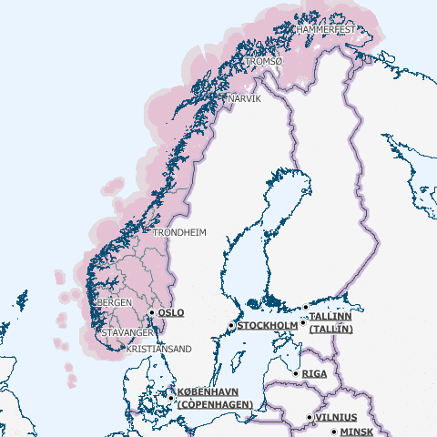

Communication longue distance
=============================

Problématique
`````````````

Cette étude a pour objectifs d'effectuer un état de l'art en termes de communication longue distance. En l'occurence, ici, il s'agit de trouver des solutions potentielles permettant de répondre à la question suivante : *comment s'effectuera la communication entre les sites distants et le site central de monitoring ?*

Pour répondre à cette question, il convient dans un premier temps de rappeller les contraintes inhérentes :
 * le site central pourra être déployé (voir migré à tout moment) partout en Europe, et a forciori n'importe où dans le monde.
 * les sites distants sont situés n'importe où en Europe, y compris les endroits les plus reculés et les moins bien desservis, que ce soit en terme de d'énergie, de télécommunications ou d'infrastructures routières.
 * la communication devra être fiable
   * les informations ne doivent pas être perdues
   * certaines stations critiques doivent inclure des capacité de reprise ou de capacité de redondance pour garder une disponibilité maximale
 * la communication doit être la moins coûteuse possible
 * le matériel devra supporter des conditions climatiques extremes

Dans un deuxième temps, les critères de selection d'une solution se porteront également sur la teneur des communications : *quelles données seront amenées à circuler dans un sens, comme dans l'autre ?*

Du site central vers les sites distants :
 * mises à jour des logiciels (fréquence : maximum toutes les semaines, mais certainement beaucoup plus espacé)

Des sites distants vers le site central :
 * les informations provenant des capteurs (fréquence : de l'ordre de la minute)

Enfin, la taille du réseau est à prendre en compte, nous partirons d'une base de simulation 10 fois plus importante que l'existant scandinave, soit :
 * 100 sites distants * 10 = 1000 sites distants
 * 1000 sites distants * 10 cuves = 10000 cuves

Solutions possibles
```````````````````

A l'heure actuelle trois méthodes de communication longue distante peuvent être envisagées pour ce système :
 * par le réseau GPRS (2G+), autrement dit par le réseau GSM et internet
 * par le réseau GPS, autrement dit par satellite
 * par courant porteur libre, autrement dit par les lignes électriques

Détails des solutions
`````````````````````

Utilisation du réseau GPRS
__________________________

Cette solution nécessite l'utilisation du réseau des télécommunications GSM. Le réseau GPRS est en réalité une extension s'appuyant sur le réseau GSM et a l'avantage d'une part de pouvoir rester connecté et d'autre part d'utiliser en plus des canaux de type voix, une passerelle vers le réseau internet. La facturation ne se fait non plus à la durée mais au débit.

*Architecture du réseau GSM/GPRS*


Les prérequis sont :
 * être à portée d'une antenne de télécommunication (BTS)
 * nécessite un abonnement auprès d'un FAI/opérateur téléphonique? Donc un abonnement par site distant ? 

La couverture du réseau GPRS (et donc GSM) sur le territoire européen est quasi totale. Il faudra s'assurer préalablement de choisir l'opérateur mobile offrant la meilleure couverture, ce qui sera donc variable suivant les pays. Dans la même idée il faudra veiller à traiter avec un opérateur présent dans la majorité des pays européens afin de négocier des prix intéressants avec un support de qualité.

Un exemple de couverture, en Norvège (opérateur : Telenor), qui comprend un certains nombres de sites isolés, notamment dans le nord :


L'utilisation du réseau UMTS ou 3G (qui utilise une partie du réseau GSM), bien qu'apportant une capacité de débit bien plus élevé, est écarté car son territoire de couverture reste très faible dans les zones reculées (ce type de réseau n'utilise pas les antennes BTS du réseau GSM). Ensuite, pour ce système, le débit offert par le réseau GPRS sera suffisant.

Concernant son implémentation, il nécessite la mise en place d'un modem compatible GSM/GPRS. Deux solutions se détachent :
 * l'achat de composants et leur adaptation avec le système embarqué du site distant 
 * l'achat d'une solution complète

De nombreux fabriquants proposent des solutions de modems GSM/GPRS embarqués particulièrement adapatés aux contraintes. Les prix varient d'une centaine d'euros l'unité à 400¤ pour les modèles hauts de gamme, avec des caractéristiques techniques qui satisfont les contraintes (données prix sur les modèles hauts de gammme) :
 * Température de fonctionnemment : -20°C à +85°C
 * Tolérance à l'humidité : 90%
 * Faible taille : 10cm*5cm*10cm
 * Consommation en communication : (< 200mA sous 14 Vdc)
 * Consommation au repos : (< 10mA sous 14 Vdc)


Sources :
 * couverture GSM : http://www.mobileworldlive.com/maps/
 * comparatifs modems chez erco&gener : http://www.ercogener.com/comparatif-modem-gsm-gprs-gps.html
 * prix (erco&gener) : http://www.kamosis.com/store/index-n-Modems_GSM_GPRS_EDGE_3G-cp-555.html
 * wikipedia


Utilisation du réseau GPS
_________________________

Les stations à distance pourraient communniquer avec la station centrale via satellite. Cette technique nécessite l'installation d'une antenne emetrice/receptrice satellite et d'un modem dédié.

Les prérequis sont :
 * être dans un milieu dégagé
 * souscrire un abonnement à un opérateur (tarification établit suivant le débit alloué et le volume de données échangé)

Avantages :
 * couverture totale
 * débit suffisant

Inconvénients :
 * cout du matériel : environ 350¤
 * abonnement plus élevé (de 25¤ pour 2Go à 100¤ pour 12Go)

Les latences sont conséquentes (autour des 650ms contre 40ms pour l'ADSL) mais négligeables pour ce système.

Deux flottes de satellites couvrant l'Europe :
 * Astra, opérateurs : Vivéole, Nordnet
 * Eutelsat, opérateurs : Connexion Verte, Sat2way, Numéo

Le matériel fournit par ces opérateurs se révelerait surement insuffisant par rapport aux contraintes du système et dans un souci d'intéropérabilité avec la solution mis en place du côté des sites distants.
Des constructeurs spécialisés dans l'embarqué proposent des modems répondant à ces contraintes, modems similaires à ceux présentés pour la solution GPRS. Cependant leurs prix varient de 1500¤ à 3500¤ l'unité.

source : 
 * offres chez Sat2way : http://www.sat2way.fr/fr/offre_haut_debit/
 * wikipedia : http://fr.wikipedia.org/wiki/Internet_par_satellite
 * prix des modems GPS : http://www.kamosis.com/store/index-n-Modems_Satellite-cp-558.html

Utilisation du courant porteur libre (CPL)
__________________________________________

Cette solution permettrait de faire circuler l'information par les lignes électriques.

Les prérequis sont :
 * être relié aux lignes électriques
 * un modem spécifique

Inconvénients :
 * libre d'utilisation chez les particuliers mais fortement réglementé voir interdit sur le réseau public dans certains pays européen
 * pas de normes définitives


Comparaison et bilan
````````````````````
Le courant porteur libre, bien que prometteur, pour des raisons principalement politiques ne peut pas être envisagés à une échelle européenne.

Reste la solution GPRS et GPS. La dernière est la plus couteuse mais ne peut pas être écartée car elle se révèle nécessaire dans certains endroits extremement isolés non couverts par le réseau GSM/GPRS.

On pourrait imagnier à ce moment là prévoir une solution par défaut GSM/GPRS et mettre en place, au cas par cas, des sites distants capable de communiquer via satellite.

