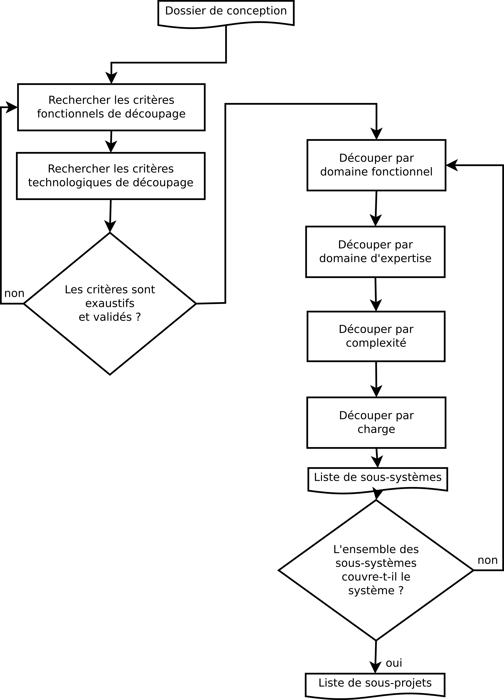

Procédure de découpage des systèmes en sous-systèmes
####################################################

Objectifs de la procédure
=========================

Ce document décrit la procédure de découpage d'un système informatique en sous
systèmes. La procédure présentée permet de mettre en place une approche
cohérente et logique pour découper le système en lots pour simplifier
l'organisation du projet.

Domaine d'application
=====================

Cette procédure s'applique dans le cadre du projet "Monitoring de sites isolés
à distance", un projet informatique pluri-disciplinaire. Elle est destinée au
chef de projet et à l'architecte technique.

Documents de référence
======================

La rédaction de cette procédure est issue des documents ci-dessous.

Procédure de Rédaction d'une procédure
 Document réalisé par Etienne Guérin, Responsable Qualité du projet.

Cours de Qualité logiciel de 3IF, chapitre 13
 Cours réalisé par M Aubry.

Manuel du Chef de Projet
 Document réalisé par MM Amghar et Aubry.

Documents réalisés à partir de cette procédure
==============================================

Cette procédure doit être suivie pour rédiger les documents présentés
ci-dessous, produits à la suite de la conception globale du système.

Plan de Management de Projet
 Document réalisé par le chef de projet, la procédure s'applique pour découper
 les systèmes en lots, afin d'organiser le projet.
Découpage du système en sous systèmes
 Document réalisé par le Chef de projet avec l'assistance du groupe d'étude en
 ingénierie, il est le document synthétisant la démarche de découpage du
 système en sous-systèmes.

Logigramme de la procédure
==========================

